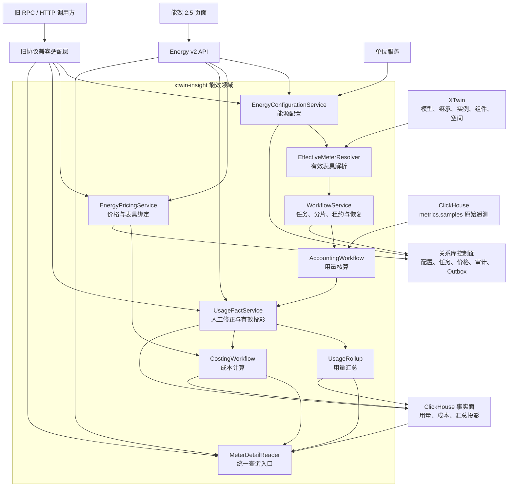
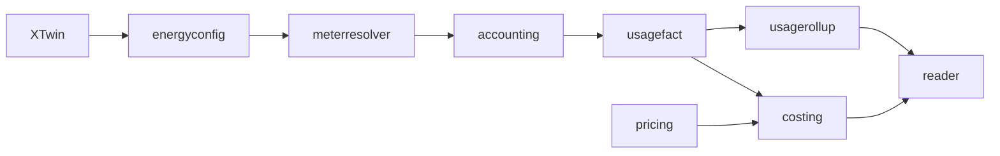
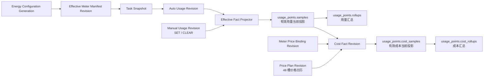
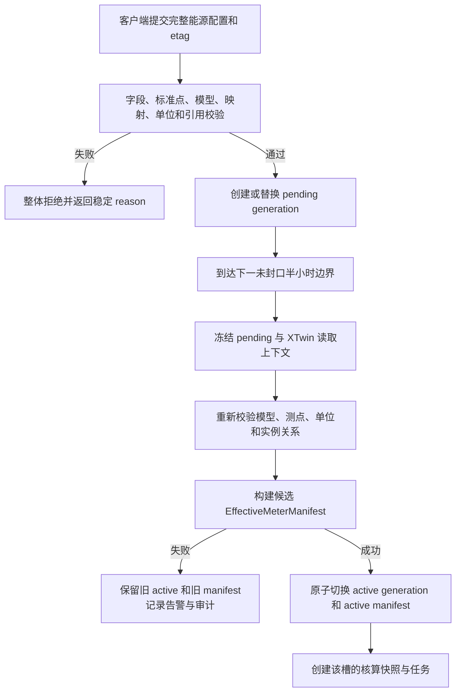
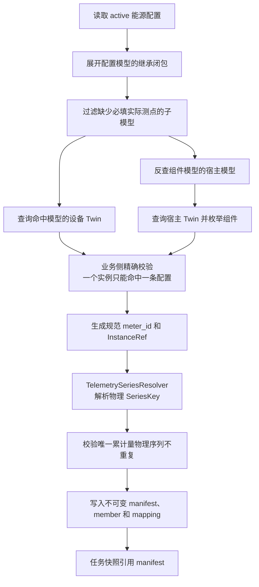
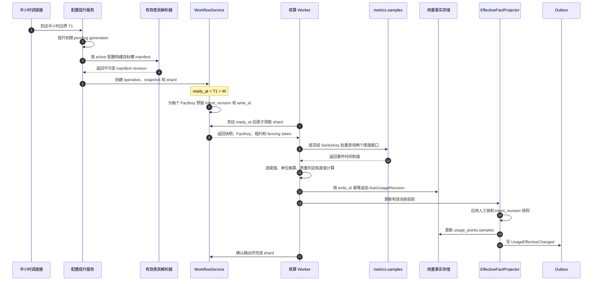
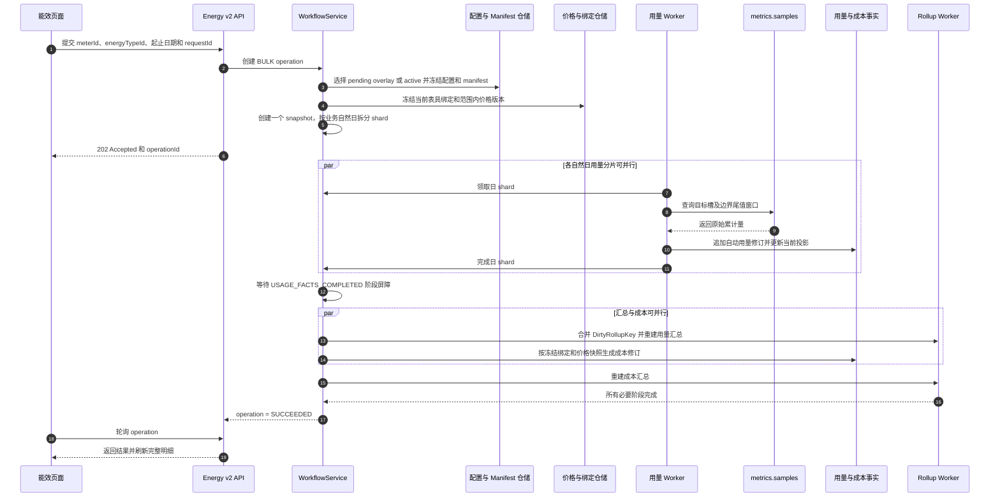
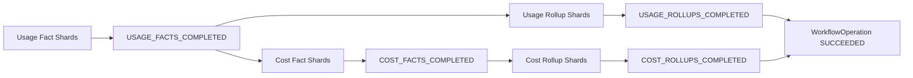
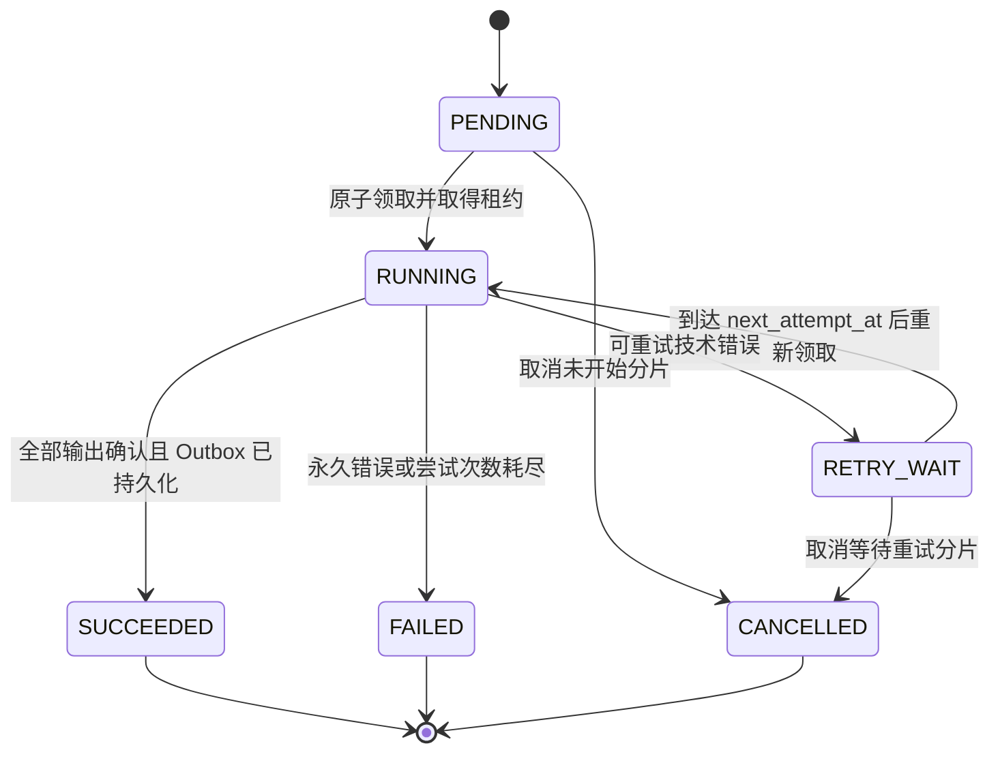
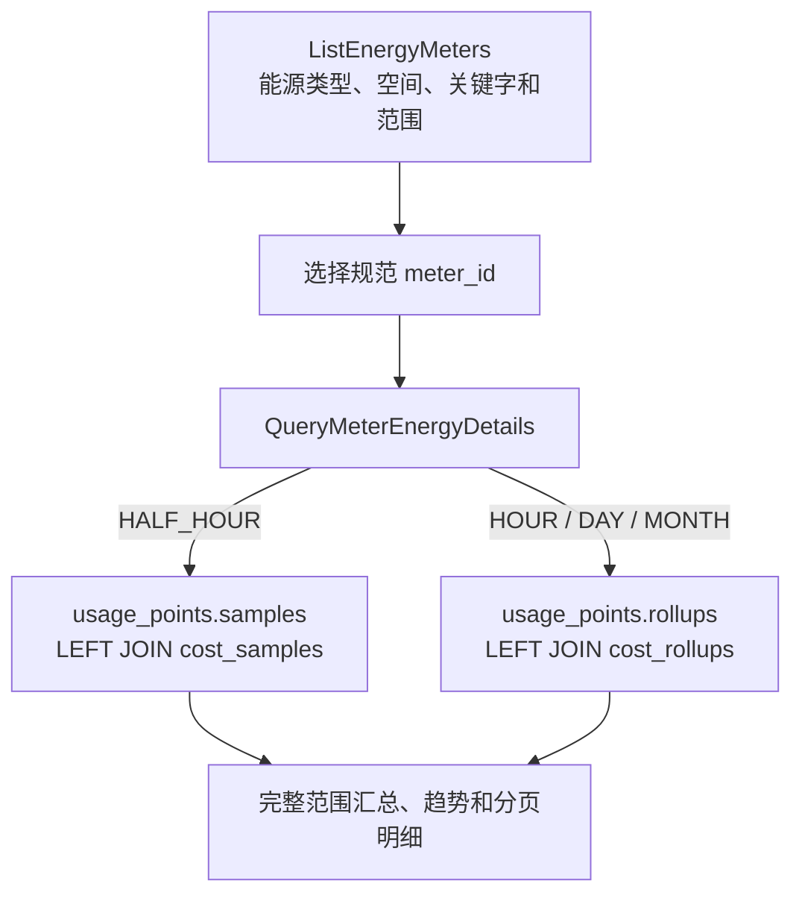

# 能效 2.5 概要设计

> 文档状态：技术评审稿
> 适用范围：需求 1、需求 2、需求 4
> 评审目标：确认总体架构、取数与核算链路、任务调度和数据一致性方案是否具备进入详细设计与开发的条件

## 1. 文档说明

### 1.1 设计范围

本文对能效 2.5 中以下能力进行概要设计：

- 能源配置、标准测点、物模型能力和实际测点映射。
- 设备及组件表具的识别、物理遥测序列解析和有效表具清单生成。
- 半小时累计量取数、用量核算、质量判定、人工修正和自动修复。
- 时、日、月用量汇总和表具明细查询。
- 计费方案、价格版本、表具应用、半小时成本和成本汇总。
- 定时任务、范围重算、任务分片、租约、重试、幂等和故障恢复。
- 新接口、旧接口兼容边界和上线切换原则。

本文不展开 protobuf 字段编号、正式 DDL、全部索引、部署容量参数和页面交互细节。这些内容在概要设计评审通过后进入详细设计。

### 1.2 设计基线

本文根据以下材料整理：

- [表具能效计费链路设计](./2026-08-27-meter-energy-accounting-billing-design.md)
- [表具能效计费前端 API 设计](./2026-08-29-meter-energy-accounting-billing-api-design.md)
- [取数逻辑说明](./取数逻辑.md)

发生不一致时，以前两份正式设计为主基线；`取数逻辑.md` 主要用于补充示例和发现待确认问题。

本文中出现的结构体、事件、快照、事实和接口字段均提供中文含义。正式 DDL、protobuf 和 Go 结构体进入详细设计后，也必须为每个字段补充中文 `COMMENT` 或代码注释。

### 1.3 建设目标

1. 建立从能源配置、有效表具、原始累计量到用量和成本的单一业务链路。
2. 使每个半小时用量和成本都可以追溯到配置、表具清单、原始尾值、价格版本和任务快照。
3. 允许迟到数据、人工修正和历史范围重算，同时保证并发任务不会覆盖更新的业务意图。
4. 将权威事实与查询投影分离，使时、日、月汇总可以重建。
5. 保留既有 RPC 和 HTTP 契约的兼容入口，但不保留第二套核算逻辑。

### 1.4 非目标与约束

- 不迁移切换前的旧配置和旧事实。
- 不对新旧链路进行双写。
- 不恢复旧引擎的零值删除、中位数补偿、自动复位推断和跨槽借值。
- 新页面只使用 `/xtwin/v3/energy/v2` 接口。
- 旧接口仅通过适配器进入新领域服务、事实和投影。
- 当前设计尚未给出容量、延迟和性能验收阈值，必须在上线评审前补充。

## 2. 设计原则

| 原则 | 说明 |
| --- | --- |
| 事实优先 | 自动用量版本、人工修订、成本版本、价格快照和审计链是追溯依据 |
| 投影可重建 | 有效当前值、时日月汇总均可由权威事实重新构建 |
| 快照执行 | 任务提交时冻结配置、表具、测点、时区和价格上下文，执行及重试不重新读取配置 |
| 意图有序 | 同一业务事实以后提交任务预留的 `intent_revision` 为准，不按完成时间覆盖 |
| 身份分层 | 表具身份、模型测点身份和物理序列键分别建模，禁止相互代替 |
| 技术失败与业务异常分离 | `MISSING/BAD` 是成功生成的业务事实，依赖失败才是任务失败 |
| 兼容层无业务逻辑 | 旧协议适配器只转换协议、身份和错误，不包含第二套核算实现 |
| 数据库时区唯一 | 半小时边界、业务日期和价格时段统一使用部署业务时区 |

## 3. 总体架构

### 3.1 系统架构图



### 3.2 模块职责

| 模块 | 核心职责 | 主要依赖 |
| --- | --- | --- |
| `energyconfig` | 原子维护能源类型、标准点、模型能力、测点映射和 active/pending 版本 | 关系库、XTwin、单位服务 |
| `meterresolver` | 展开模型继承，枚举设备与组件，解析物理序列，生成不可变 manifest | XTwin、能源配置 |
| `accounting` | 调度半小时核算和范围重算，选择尾样本，计算用量及自动版本 | Workflow、ClickHouse 原始遥测 |
| `usagefact` | 维护人工 `SET/CLEAR`、自动与人工版本选择、有效当前投影 | 关系库、ClickHouse 事实面 |
| `usagerollup` | 从半小时当前事实重建时、日、月汇总 | ClickHouse 事实面 |
| `pricing` | 维护计费方案、不可变价格版本、48 槽日历和当前表具绑定 | 关系库、能源配置 |
| `costing` | 根据有效用量、当前绑定和历史日期价格版本生成成本事实 | UsageFact、Pricing、Workflow |
| `workflow` | 维护 operation、snapshot、shard、租约、重试、Outbox 和 reconciliation | 关系库、Worker |
| `reader` | 提供表具列表、明细、汇总、趋势和兼容查询的唯一入口 | XTwin、ClickHouse 投影 |

### 3.3 依赖方向



`xtwin-expr` 不执行需求 1、2、4 的新核算逻辑。历史表达式实现仅作为旧协议行为参考。

## 4. 核心身份与数据模型

### 4.1 身份分层

| 层次 | 标识 | 用途 |
| --- | --- | --- |
| 业务表具 | `meter_id` | 标识设备表具或组件表具，是事实和查询的业务身份 |
| 结构化实例 | `InstanceRef` | 保存 `TwinID` 与 `ComponentName`，供内部解析和索引 |
| 模型测点 | `ModelTelemetryName` | 表示能源配置引用的物模型遥测点 |
| 物理序列 | `SourceKind + SeriesKey` | 精确定位 `metrics.samples` 中的原始时序数据 |
| 半小时事实 | `FactKey` | 唯一标识某表具、某能源类型、某半小时槽的业务结果 |

`InstanceRef` 字段：

| 字段 | 中文注释 |
| --- | --- |
| `TwinID` | XTwin 中宿主 Twin 的稳定标识 |
| `ComponentName` | 组件实例名称；设备表具为空，组件表具填写所属 Twin 内的组件名 |

设备表具的规范身份：

```text
xtwin://twins/{percent-encoded-twin-id}
```

组件表具的规范身份：

```text
xtwin://twins/{percent-encoded-twin-id}/components/{percent-encoded-component-name}
```

`meter_id`、模型遥测点和 `metrics.samples.__name__` 不是同一概念。物理序列键只能由版本化解析器在 manifest 构建阶段生成，worker 不得临时拼接。

### 4.2 半小时事实键

```text
FactKey = (
  meter_id,          // 规范表具 URI，区分设备和组件表具
  energy_type_id,    // 能源类型稳定 UUID
  slot_start_utc,    // 半小时槽的 UTC 起始时间
  slot_width = 30m   // 槽宽，当前固定为 30 分钟
)
```

| 字段 | 中文注释 |
| --- | --- |
| `meter_id` | 规范表具身份，是事实查询和关联的主身份 |
| `energy_type_id` | 能源类型稳定 UUID，创建后永久不变 |
| `slot_start_utc` | 半小时槽的 UTC 起始时间 |
| `slot_width` | 槽宽，当前版本固定为 30 分钟 |

同一 `FactKey` 可以存在多个自动版本和人工版本，但只能有一个当前有效投影。任务 ID、测点 ID和价格版本都不是 `FactKey` 的组成部分。

### 4.3 版本和投影关系



### 4.4 业务时区

- 部署级配置项：`energy_billing.business_timezone`。
- 默认值：`Asia/Shanghai`。
- 半小时槽、日期范围、日月周期和计费时段先在业务时区解释，再转换为 UTC 存储。
- 首次产生事实时，将业务时区和事实模型版本写入 `billing_runtime_identity`。
- 已存在事实后，部署配置时区与运行身份不一致时，核算写服务拒绝启动。
- 浏览器时区、请求时区和进程 `time.Local` 都不能成为业务计算依据。

## 5. 能源配置与有效表具解析

### 5.1 能源配置聚合

`EnergyConfiguration` 是能源配置唯一写聚合，聚合键为 `energy_type_id`。聚合包含：

- 能源类型基础字段和半小时增量上限。
- 唯一累计量、主瞬时量和过程瞬时量标准点。
- 物模型的能源计量和供电能力。
- 标准点到实际遥测点的映射。
- active、pending、promoting generation 指针。
- active manifest 指针、etag、内置标记和审计状态。

客户端每次提交完整聚合，服务端在一个关系库事务中完成校验、正式 ID 分配、pending generation、审计和 Outbox 写入。任何校验失败都不得产生部分 pending。

`EnergyConfigurationState` 逻辑字段：

| 字段 | 中文注释 |
| --- | --- |
| `energy_type_id` | 能源配置聚合的稳定 UUID |
| `active_generation` | 当前核算生效的配置版本号 |
| `pending_generation` | 等待下一边界生效的配置版本号；没有待生效配置时为空 |
| `promoting_generation` | 正在执行边界提升的配置版本号；没有提升任务时为空 |
| `active_manifest_id` | 当前生效的有效表具 manifest ID |
| `etag` | 配置聚合的并发控制标记 |
| `builtin` | 是否为系统内置能源配置 |
| `technical_status` | promotion 和 manifest 构建使用的内部技术状态，不向产品页面暴露 |

`EnergyConfigurationGeneration` 逻辑字段：

| 字段 | 中文注释 |
| --- | --- |
| `energy_type_id` | 所属能源类型稳定 UUID |
| `generation` | 能源配置单调递增版本号 |
| `display_name` | 能源类型展示名称，创建后不可修改 |
| `measurement_kind` | 度量类型，区分一次能源和工质 |
| `half_hour_increment_limit` | 单个半小时允许的累计量最大增量 |
| `tce_factor` | 标煤折算系数；不适用时为空 |
| `co2_factor` | 二氧化碳折算系数；不适用时为空 |
| `effective_slot_utc` | 本 generation 计划生效的半小时槽 UTC 起点 |
| `content_fingerprint` | 完整配置内容指纹 |
| `request_id` | 创建本 generation 的幂等请求 ID |
| `created_by` | 配置提交者稳定 ID |
| `created_at` | 配置版本创建时间 |

`StandardPoint` 逻辑字段：

| 字段 | 中文注释 |
| --- | --- |
| `standard_point_id` | 标准点稳定 UUID，跨 generation 保持不变 |
| `category` | 标准点分类，取值为累计量或瞬时量 |
| `role` | 标准点角色，取值为唯一累计量、主瞬时量或过程瞬时量 |
| `display_name` | 标准点展示名称，在能源类型内唯一 |
| `unit_id` | 标准点权威单位 ID |
| `sort_order` | 标准点在产品页面中的稳定展示顺序 |

`ModelEnergyConfig` 与 `StandardPointMapping` 逻辑字段：

| 字段 | 中文注释 |
| --- | --- |
| `model_id` | 被配置的物模型稳定 ID |
| `capabilities` | 模型能力集合，包含 `METERING`、`SUPPLY` 或两者 |
| `standard_point_id` | 映射目标标准点的稳定 UUID |
| `telemetry_point_id` | 模型或其继承闭包中的实际遥测点 ID |
| `source_model_id` | 实际遥测点定义所在的来源模型 ID |
| `source_unit_id` | 实际遥测点原始单位 ID |
| `scale` | 原始单位换算为标准单位的缩放系数 |
| `offset` | 原始单位换算为标准单位的偏移量；累计量必须为零 |

### 5.2 配置生效流程



产品查询返回 pending overlay；没有 pending 时返回 active。核算任务只使用已经生效的 active 或任务快照，产品页面不暴露 promotion 和 manifest 技术状态。

### 5.3 有效表具解析流程



有效表具判定规则：

1. 模型配置必须包含 `METERING` 能力。
2. 唯一累计量和主瞬时量映射必须完整。
3. 实际测点必须属于配置模型或其继承闭包。
4. 实际单位必须与标准点单位同量纲。
5. 父模型配置和子模型配置互斥，一个实例最多命中一条配置。
6. 设备和组件均可成为表具；组件身份由宿主 Twin ID 和组件名组成。
7. 没有遥测样本不影响表具资格，后续核算产生 `MISSING`。
8. 同一 manifest 中，不同表具的唯一累计量不得解析到同一物理序列。

### 5.4 物理序列解析

首版固定：

```text
SourceKind = METRICS_SAMPLES              // 原始遥测来源类型，表示 metrics.samples
SeriesKeyCodec = XTWIN_TELEMETRY_V1       // 物理序列键的首版编码规则
```

`TelemetrySourceRef` 字段：

| 字段 | 中文注释 |
| --- | --- |
| `SourceKind` | 原始遥测来源类型，首版固定为 `METRICS_SAMPLES` |
| `SeriesKey` | 原始时序表的物理序列键，首版对应 `metrics.samples.__name__` |
| `SeriesKeyCodec` | 生成物理序列键所使用的版本化编码规则 |
| `TwinID` | 业务表具所属 Twin 的稳定 ID |
| `TwinName` | 上游采集链用于构造物理序列前缀的 Twin 名称快照 |
| `ComponentName` | 组件实例名称；设备测点为空 |
| `ModelTelemetryName` | 能源配置引用的物模型遥测点名称 |
| `ResolvedTelemetryName` | 应用组件实例替换规则后得到的实际遥测名称 |
| `Fingerprint` | 对来源类型、编码规则、实例和序列字段计算的 SHA-256 指纹 |

`EffectiveMeterManifest` 逻辑字段：

| 字段 | 中文注释 |
| --- | --- |
| `manifest_id` | 一次完整有效表具解析结果的稳定 ID |
| `energy_type_id` | 本 manifest 所属能源类型 |
| `config_generation` | 构建本 manifest 使用的配置版本 |
| `target_slot_start_utc` | 本 manifest 适用的目标半小时槽 UTC 起点 |
| `xtwin_read_time` | 构建时记录的 XTwin 读取时点 |
| `content_fingerprint` | 对 manifest 成员和映射计算的完整内容指纹 |
| `created_at` | manifest 创建时间 |

`EffectiveMeterMember` 逻辑字段：

| 字段 | 中文注释 |
| --- | --- |
| `manifest_id` | 所属有效表具 manifest ID |
| `meter_id` | 设备或组件表具的规范 URI |
| `twin_id` | 表具所属 Twin 的稳定 ID |
| `component_name` | 组件实例名称；设备表具为空 |
| `actual_model_id` | 实例实际使用的物模型 ID |
| `matched_config_model_id` | 通过继承规则命中的能源配置模型 ID |
| `display_name_snapshot` | 构建 manifest 时的表具展示名称快照 |
| `metadata_fingerprint` | 实例及组件关键元数据指纹 |

`EffectiveMeterMapping` 逻辑字段：

| 字段 | 中文注释 |
| --- | --- |
| `manifest_id` | 所属有效表具 manifest ID |
| `meter_id` | 所属规范表具身份 |
| `standard_point_id` | 本映射对应的标准点 ID |
| `source_kind` | 原始遥测来源类型 |
| `source_series_key` | manifest 构建时解析并冻结的物理序列键 |
| `source_key_codec` | 物理序列键编码规则版本 |
| `twin_name_snapshot` | 构造物理序列前缀所使用的 Twin 名称快照 |
| `model_telemetry_name` | 配置引用的模型遥测点名称 |
| `resolved_telemetry_name` | 解析到设备或组件实例后的实际遥测名称 |
| `source_unit_id` | 原始遥测值单位 ID |
| `standard_unit_id` | 标准点单位 ID |
| `scale` | 原始单位到标准单位的缩放系数 |
| `offset` | 原始单位到标准单位的偏移量 |
| `source_fingerprint` | 对结构化来源和物理序列字段计算的指纹 |
| `telemetry_metadata_fingerprint` | 对遥测点关键元数据计算的指纹 |

设备测点：

```text
ResolvedTelemetryName = ModelTelemetryName              // 设备测点无需替换组件段
SeriesKey = TwinName + "_" + ModelTelemetryName         // 设备物理序列键
```

组件测点：

```text
ModelTelemetryName 必须是以 _0 结尾的标准三段式名称       // 模型级组件占位测点
将最后一段 0 替换为 ComponentName                         // 得到组件实例实际测点名
SeriesKey = TwinName + "_" + ResolvedTelemetryName       // 组件物理序列键
```

解析结果连同 `TwinID`、`TwinName`、组件名、模型测点、codec、来源指纹和单位换算参数一起冻结到 manifest。后续任务、重试和历史重算只读取冻结结果。

## 6. 原始遥测取数逻辑

### 6.1 数据源

- 原始数据继续使用 ClickHouse `metrics.samples`。
- `metrics.samples` 是上游采集形成的物理累计量序列，不是有效用量事实。
- 首版 `SeriesKey` 精确对应 `metrics.samples.__name__`。
- 页面和下游服务禁止直接查询原始表。

### 6.2 半小时槽与尾值窗口

目标槽：

```text
S = [T0, T1)           // 当前目标槽，左闭右开
P = [T0 - 30m, T0)     // 与当前槽紧邻的上一槽，左闭右开
```

尾值窗口：

```text
W = min(30m, max(10m, 2 * acquisition_interval))
// W：从槽末向前选择尾样本的窗口宽度
// acquisition_interval：权威采集周期；当前不可得时 W 回退为 10 分钟
```

当前仓库没有标准采集周期的权威来源，首版统一使用 `W = 10m`：

```text
previous_tail = [T0 - W, T0) 内事件时间最晚的样本    // 上一槽尾值
current_tail  = [T1 - W, T1) 内事件时间最晚的样本    // 当前槽尾值
```

样本时间恰好等于 `T0` 时属于当前槽，等于 `T1` 时属于下一槽。上一槽缺失时不继续向前寻找更早样本。

### 6.3 查询示例

核算本地时间 `[10:00, 10:30)` 时，查询：

```text
上一尾值窗口：[09:50, 10:00)
当前尾值窗口：[10:20, 10:30)
```

逻辑 SQL：

| 查询字段 | 中文注释 |
| --- | --- |
| `__name__` | manifest 中冻结的物理序列键 |
| `event_time` | 原始样本事件时间，用于窗口归属和尾值排序 |
| `value` | 原始累计量值，后续按快照中的单位参数标准化 |

```sql
SELECT __name__, event_time, value
FROM metrics.samples
WHERE __name__ IN (:frozen_series_keys)
  AND (
       event_time >= :previous_window_start
       AND event_time < :slot_start
    OR event_time >= :current_window_start
       AND event_time < :slot_end
  )
ORDER BY __name__, event_time
```

worker 按物理序列和窗口分组，每个窗口选择事件时间最晚的样本。相同事件时间存在不同值时，当前设计不定义确定性决胜规则，属于上游数据质量边界。

### 6.4 单位换算与用量计算

```text
standard_value = raw_value * scale + offset
// raw_value：原始累计量值；scale：缩放系数；offset：偏移量；standard_value：标准单位值

usage = normalized_current_tail - normalized_previous_tail
// normalized_current_tail：当前标准化尾值；normalized_previous_tail：上一标准化尾值；usage：当前槽用量
```

累计量换算要求 `offset = 0`，避免差值被偏移量污染。范围重算的第一个目标槽必须额外读取上一槽尾值窗口。

### 6.5 质量状态

| 判定条件 | 状态 | `reason_code` | 用量 |
| --- | --- | --- | --- |
| 两个尾值都缺失 | `MISSING` | `MISSING_BOTH_TAILS` | `null` |
| 当前尾值缺失 | `MISSING` | `MISSING_CURRENT_TAIL` | `null` |
| 上一尾值缺失 | `MISSING` | `MISSING_PREVIOUS_TAIL` | `null` |
| 当前尾值不是有效数值 | `BAD` | `INVALID_CURRENT_TAIL` | `null` |
| 上一尾值不是有效数值 | `BAD` | `INVALID_PREVIOUS_TAIL` | `null` |
| 当前标准化值小于上一标准化值 | `BAD` | `COUNTER_ROLLBACK` | `null` |
| 差值严格大于能源类型上限 | `BAD` | `INCREMENT_LIMIT_EXCEEDED` | `null` |
| 其余情况 | `NORMAL` | 空 | 计算值 |

两个尾值相等时生成 `NORMAL` 零用量。累计量回退和严格超限只否定当前槽；如果当前尾值本身是有效数值，仍可作为下一槽基线。

### 6.6 取数边界

- 尾样本选择不能跨越配置生效、累计量测点切换、表具停用或表具身份边界。
- 首次启用、重新启用和累计量映射切换后的首个预期槽生成 `MISSING_PREVIOUS_TAIL`。
- 任务依赖失败、快照损坏和单位契约损坏不能伪装成 `MISSING/BAD`。
- 每个已封口且与 manifest 有效区间相交的预期槽最终都应有当前投影行。

## 7. 半小时自动核算

### 7.1 自动核算时序图



### 7.2 自动修订

`AutoUsageRevision` 至少保存：

- `FactKey`、自动版本和 `intent_revision`。
- `snapshot_id`、配置 generation、manifest ID 和业务时区。
- 上一尾值和当前尾值的事件时间、原值和标准化值。
- 用量、状态和质量原因。
- 输入指纹、计算指纹和稳定 `write_id`。

`AutoUsageRevision` 字段：

| 字段 | 中文注释 |
| --- | --- |
| `meter_id` | 规范表具身份 |
| `energy_type_id` | 能源类型稳定 UUID |
| `slot_start_utc` | 目标半小时槽 UTC 起始时间 |
| `slot_width` | 槽宽，当前固定为 30 分钟 |
| `auto_revision` | 同一 `FactKey` 下自动修订的追加版本号 |
| `intent_revision` | 任务提交时预留的业务意图顺序，决定自动结果覆盖优先级 |
| `snapshot_id` | 本次核算使用的不可变任务快照 ID |
| `config_generation` | 本次核算使用的能源配置版本 |
| `manifest_id` | 本次核算使用的有效表具清单版本 |
| `business_timezone` | 解释半小时边界和业务日期的时区快照 |
| `previous_tail_event_time` | 上一槽尾样本的事件时间；没有样本时为空 |
| `previous_tail_raw_value` | 上一槽尾样本原始值；没有样本时为空 |
| `previous_tail_standard_value` | 上一槽尾样本换算后的标准单位值；没有有效值时为空 |
| `current_tail_event_time` | 当前槽尾样本的事件时间；没有样本时为空 |
| `current_tail_raw_value` | 当前槽尾样本原始值；没有样本时为空 |
| `current_tail_standard_value` | 当前槽尾样本换算后的标准单位值；没有有效值时为空 |
| `usage_value` | 当前半小时用量；`MISSING/BAD` 时为空，合法零值保存为零 |
| `usage_status` | 自动事实状态，只允许 `NORMAL/MISSING/BAD` |
| `reason_code` | 稳定质量原因码；正常时为空 |
| `input_fingerprint` | 对本次实际选中输入计算的指纹，用于识别迟到数据变化 |
| `calculation_fingerprint` | 对计算规则和输出计算的指纹，用于幂等与审计 |
| `write_id` | 跨重试和不确定提交复用的稳定幂等写入 ID |
| `calculated_at` | 本次自动核算完成时间 |

同一快照、同一输入和同一 `write_id` 的重试不得产生语义重复版本。

### 7.3 有效用量投影

`EffectiveFactProjector` 的选择顺序：

1. 最新人工动作是 `SET` 时，使用人工值，状态为 `MANUAL_CORRECTED`。
2. 最新人工动作是 `CLEAR` 或从未人工修正时，选择最高有效 `intent_revision` 的自动版本。
3. 没有有效自动版本时，保留明确的 `MISSING/BAD` 或无值结果。

人工锁期间，自动任务仍生成候选版本。候选值与人工值不一致，或候选状态为 `MISSING/BAD` 时，投影记录 `manual_conflict=true`，但不新增事实状态。

有效用量当前投影关键字段：

| 字段 | 中文注释 |
| --- | --- |
| `effective_revision` | 当前有效用量版本，供查询和人工命令乐观并发使用 |
| `effective_source` | 当前值来源，区分自动修订和人工修订 |
| `usage_value` | 当前有效用量；无有效值时为空 |
| `usage_status` | 当前用量状态，可包含 `MANUAL_CORRECTED` |
| `reason_code` | 当前自动质量原因；人工值生效时通常为空 |
| `manual_revision_id` | 当前生效或最近关联的人工修订 ID |
| `manual_conflict` | 人工锁值是否与最新自动候选发生冲突 |
| `auto_candidate_revision` | 人工锁期间最新自动候选版本 |
| `auto_candidate_status` | 人工锁期间最新自动候选状态 |
| `auto_candidate_value` | 人工锁期间最新自动候选用量 |
| `write_seq` | 防止 ClickHouse 当前投影被乱序覆盖的技术序号 |

`UsageRollup` 字段：

| 字段 | 中文注释 |
| --- | --- |
| `meter_id` | 汇总所属规范表具身份 |
| `energy_type_id` | 汇总所属能源类型 |
| `grain` | 汇总粒度，取值为 `HOUR/DAY/MONTH` |
| `period_start_utc` | 汇总周期 UTC 起始时间 |
| `period_end_utc` | 汇总周期 UTC 结束时间 |
| `expected_count` | 当前周期内应存在的半小时事实数量 |
| `normal_count` | `NORMAL` 半小时事实数量 |
| `manual_count` | `MANUAL_CORRECTED` 半小时事实数量 |
| `missing_count` | `MISSING` 半小时事实数量 |
| `bad_count` | `BAD` 半小时事实数量 |
| `valid_count` | 可参与汇总的正常和人工修正事实数量 |
| `usage_total` | 所有有效半小时用量之和 |
| `rollup_status` | 用量完整性，取值为 `COMPLETE/ABNORMAL` |
| `last_tail_value` | 周期内最后一个现存尾值，仅供页面参考 |
| `last_tail_event_time` | 周期内最后一个现存尾值的事件时间 |
| `business_timezone` | 计算本周期边界时使用的业务时区 |
| `write_seq` | 防止汇总投影乱序覆盖的技术序号 |

### 7.4 自动修复

- 按部署业务时区每日回扫最近 3 个完整自然日。
- 重新选择上一尾值和当前尾值，并与已保存输入指纹比较。
- 输入变化时重新核算目标槽 `S` 和后一槽 `S+1`。
- 超出自动回扫范围的数据变化由页面范围重算处理。
- 修复任务使用新的业务意图版本，不能被更早的定时任务覆盖。

## 8. 人工修正与范围重算

### 8.1 人工 `SET/CLEAR`

- `SET` 指定某个 `FactKey` 的有效用量，并锁定当前事实。
- 同一槽可以再次 `SET`，每次都追加人工修订。
- `CLEAR` 解除人工锁，回落到当前最高有效自动版本。
- `base_effective_revision` 用于乐观并发控制。
- `request_id` 用于命令幂等。
- 人工命令不修改原始尾值和自动修订。

`ManualUsageRevision` 字段：

| 字段 | 中文注释 |
| --- | --- |
| `manual_revision_id` | 人工修订稳定 ID |
| `meter_id` | 被修正的规范表具身份 |
| `energy_type_id` | 被修正事实所属能源类型 |
| `slot_start_utc` | 被修正半小时槽的 UTC 起始时间 |
| `manual_revision` | 同一 `FactKey` 下人工修订的追加版本号 |
| `base_effective_revision` | 操作者读取到的有效版本，用于拒绝陈旧页面覆盖 |
| `previous_manual_revision_id` | 同一 `FactKey` 的前一人工修订 ID |
| `action` | 人工动作，取值为 `SET` 或 `CLEAR` |
| `previous_status` | 操作前的有效用量状态 |
| `previous_usage_value` | 操作前的有效用量；无值时为空 |
| `new_usage_value` | `SET` 指定的新用量；`CLEAR` 时为空 |
| `reason` | 人工修正原因，允许为空 |
| `operator_id` | 操作者稳定 ID |
| `operator_display_name` | 操作者展示名称快照 |
| `operated_at` | 人工操作时间 |
| `request_id` | 人工命令幂等请求 ID |

人工命令成功表示修订、幂等结果、审计和 Outbox 已经持久化，不表示用量投影、汇总和成本已经全部更新。

### 8.2 范围重算时序图



### 8.3 范围重算规则

1. 一次只处理一个 `meter_id + energy_type_id`。
2. 起止日期均包含，按业务时区转换为左闭右开区间。
3. 第一个目标槽额外读取上一槽尾值窗口。
4. 额外核算范围结束后的第一个半小时槽，因为它依赖最后目标槽的尾值。
5. 人工锁定槽继续生成自动候选，但不覆盖人工值。
6. 按自然日拆分 shard，夏令时日期使用实际槽数。
7. 用量、用量汇总、成本和成本汇总全部完成后，operation 才成功。
8. 某个分片失败不回滚其他已经确认的事实，只重试失败分片或阶段。

### 8.4 阶段屏障

范围重算可能一次更新大量半小时事实。为避免每条事实都触发一次日/月汇总并使页面观察到新旧结果混合，概要设计采用阶段屏障：



正常单槽核算和单槽人工修正可以立即重建受影响汇总；范围重算和批量修复先合并 `DirtyRollupKey`，待相应事实阶段完成后再批量重建。

## 9. 价格方案与成本计算

### 9.1 价格方案

- `PricePlan` 是写聚合根，ID 由服务生成且永久不变。
- 一个能源类型允许多个方案，一个表具在同一能源类型下最多有一个当前方案。
- 已生效价格版本不可修改或删除；编辑未来版本时创建新的不可变修订。
- 第一条价格版本允许历史、当天或未来业务日期。
- 支持 `FLAT`、`TOU_3` 和 `TOU_4`。
- 原始价格规则必须编译为连续、无重叠、无空洞的全天 48 个半小时槽。
- 价格单位固定为 `CNY / 唯一累计量标准单位`。

`PricePlan` 字段：

| 字段 | 中文注释 |
| --- | --- |
| `price_plan_id` | 计费方案稳定 UUID，创建后永久不变 |
| `display_name` | 计费方案展示名称，在当前数据库实例内唯一 |
| `energy_type_id` | 方案所属能源类型，创建后不可修改 |
| `etag` | 方案聚合并发控制标记 |
| `applied_meter_count` | 当前应用该方案的表具数量 |
| `created_by` | 创建人稳定 ID |
| `created_at` | 创建时间 |
| `deleted_at` | 逻辑删除时间；未删除时为空 |

`PricePlanRevision` 字段：

| 字段 | 中文注释 |
| --- | --- |
| `price_plan_revision_id` | 不可变价格版本 ID |
| `price_plan_id` | 所属计费方案 ID |
| `effective_date` | 按业务时区解释的生效日期 |
| `pricing_type` | 价格类型，取值为 `FLAT/TOU_3/TOU_4` |
| `currency` | 币种，当前固定为 `CNY` |
| `unit_id` | 唯一累计量标准单位 ID 快照 |
| `business_timezone` | 编译价格日历时使用的业务时区 |
| `raw_rule_fingerprint` | 原始价格规则内容指纹 |
| `calendar_fingerprint` | 48 槽编译日历内容指纹 |
| `created_by` | 版本创建人稳定 ID |
| `created_at` | 版本创建时间 |

### 9.2 表具绑定

应用弹窗提交当前方案的完整表具集合、集合 etag 和 `request_id`。服务在一个关系库事务中重新校验：

- 方案和能源类型有效。
- 表具仍然属于当前有效 manifest。
- 表具具备唯一累计量映射。
- 表具未被其他方案占用。
- 集合 etag 未变化。

任一表具冲突时整体失败。改绑和解绑不自动重算历史；之后提交的范围重算使用任务提交时冻结的当前绑定。

`MeterPriceBindingState` 字段：

| 字段 | 中文注释 |
| --- | --- |
| `meter_id` | 当前绑定的规范表具身份 |
| `energy_type_id` | 当前绑定所属能源类型 |
| `price_plan_id` | 当前生效的计费方案 ID；未绑定时为空 |
| `binding_revision` | 当前绑定状态的单调修订号 |
| `etag` | 当前绑定集合的并发控制标记 |

### 9.3 成本状态与计算

成本状态按固定顺序判定：

```text
NO_USAGE -> NO_PRICE_PLAN -> NO_PRICE_VERSION -> COMPUTED
```

| 条件 | 状态 | 金额 |
| --- | --- | --- |
| 用量为 `MISSING/BAD` | `NO_USAGE` | `null` |
| 有效用量但没有当前绑定 | `NO_PRICE_PLAN` | `null` |
| 有绑定但业务日期无适用版本 | `NO_PRICE_VERSION` | `null` |
| 有效用量、绑定和价格齐全 | `COMPUTED` | `usage * unit_price` |

零单价生成 `COMPUTED` 零成本。半小时成本以高精度保存，不在事实层舍入；Reader 输出人民币金额时使用 `ROUND_HALF_UP` 舍入到 2 位小数。

`CostFactRevision` 字段：

| 字段 | 中文注释 |
| --- | --- |
| `meter_id` | 规范表具身份 |
| `energy_type_id` | 能源类型稳定 UUID |
| `slot_start_utc` | 成本所属半小时槽 UTC 起始时间 |
| `slot_width` | 槽宽，当前固定为 30 分钟 |
| `cost_revision` | 同一 `FactKey` 下的成本追加版本号 |
| `cost_intent_revision` | 成本任务提交顺序，决定当前成本覆盖优先级 |
| `effective_usage_revision` | 本成本引用的有效用量版本 |
| `binding_revision` | 任务快照中冻结的当前表具绑定版本 |
| `price_plan_id` | 成本使用的计费方案 ID；前置状态未解析时为空 |
| `price_plan_revision_id` | 成本使用的不可变价格版本 ID；未适用时为空 |
| `price_calendar_fingerprint` | 计价使用的 48 槽日历指纹 |
| `pricing_category` | 当前半小时槽对应的平价、尖、峰、平或谷类别 |
| `unit_price` | 当前半小时槽使用的单位价格；未适用时为空 |
| `unit_id` | 用量计价单位 ID 快照 |
| `currency` | 成本币种，当前固定为 `CNY` |
| `cost_amount_raw` | 未提前舍入的高精度成本；未计算时为空 |
| `cost_status` | `COMPUTED/NO_USAGE/NO_PRICE_PLAN/NO_PRICE_VERSION` |
| `reason_code` | 成本未计算或异常时的稳定原因码 |
| `business_timezone` | 选择业务日期和价格槽时使用的时区快照 |
| `task_snapshot_id` | 生成本成本的任务快照 ID |
| `write_id` | 成本事实幂等写入 ID |
| `calculated_at` | 成本计算完成时间 |

`CostRollup` 字段：

| 字段 | 中文注释 |
| --- | --- |
| `meter_id` | 汇总所属规范表具身份 |
| `energy_type_id` | 汇总所属能源类型 |
| `grain` | 汇总粒度，取值为 `HOUR/DAY/MONTH` |
| `period_start_utc` | 汇总周期 UTC 起始时间 |
| `period_end_utc` | 汇总周期 UTC 结束时间 |
| `expected_count` | 当前周期内应存在的半小时成本事实数量 |
| `computed_count` | `COMPUTED` 半小时成本数量 |
| `no_usage_count` | 因没有有效用量而未计算的槽数量 |
| `no_price_plan_count` | 因没有当前计费方案而未计算的槽数量 |
| `no_price_version_count` | 因业务日期没有适用价格版本而未计算的槽数量 |
| `cost_amount_raw_total` | 已计算半小时高精度成本之和 |
| `flat_amount_raw` | 统一价类别高精度成本合计 |
| `super_peak_amount_raw` | 尖价类别高精度成本合计 |
| `peak_amount_raw` | 峰价类别高精度成本合计 |
| `shoulder_amount_raw` | 平价类别高精度成本合计 |
| `off_peak_amount_raw` | 谷价类别高精度成本合计 |
| `cost_completeness` | 成本完整性，取值为 `COMPLETE/PARTIAL/MISSING` |
| `write_seq` | 防止成本汇总乱序覆盖的技术序号 |

### 9.4 成本版本保护

每个 `FactKey` 预留单调的 `cost_intent_revision`。成本当前投影只有同时满足以下条件时才更新：

- `cost_intent_revision` 高于当前值。
- 成本引用的 `effective_usage_revision` 仍然是当前有效用量版本。

因此，旧用量版本的成本任务即使最后完成，也不能覆盖新用量版本对应的成本。

## 10. 任务调度设计

### 10.1 核心对象

| 对象 | 作用 |
| --- | --- |
| `WorkflowOperation` | 一次完整业务操作，是进度、结果和审计的观察单位 |
| `TaskSnapshot` | 冻结本次操作使用的配置、manifest、时区、范围、尾值规则和价格上下文 |
| `TaskShard` | worker 可独立领取、执行和重试的最小任务单元 |
| `FactKey` | shard 最终要产生的半小时业务结果 |
| `intent_revision` | 决定同一用量事实的自动版本覆盖顺序 |
| `cost_intent_revision` | 决定同一成本事实的版本覆盖顺序 |
| `write_id` | 保证跨重试和不确定提交下的幂等写入 |

`WorkflowOperation` 关键字段：

| 字段 | 中文注释 |
| --- | --- |
| `operation_id` | 一次完整业务操作的稳定 ID |
| `operation_type` | 操作类型，例如定时核算、修复或范围重算 |
| `priority` | 调度优先级 |
| `status` | 操作整体状态 |
| `stage` | 当前执行阶段，例如用量、汇总、成本或完成 |
| `root_operation_id` | Redrive 操作关联的原始 operation ID |
| `redrive_generation` | 同一根 operation 的技术重新驱动代次 |
| `success_shard_count` | 已成功分片数量 |
| `failed_shard_count` | 已失败分片数量 |
| `success_fact_count` | 已确认成功业务事实数量 |
| `failed_fact_count` | 因技术原因未完成的业务事实数量 |
| `created_by` | 操作提交者稳定 ID |
| `created_at` | 操作创建时间 |
| `finished_at` | 操作进入终态的时间 |

`TaskSnapshot` 关键字段：

| 字段 | 中文注释 |
| --- | --- |
| `snapshot_id` | 不可变任务快照 ID |
| `operation_id` | 所属完整业务操作 ID |
| `config_generation` | 冻结的能源配置版本 |
| `manifest_id` | 冻结的有效表具清单版本 |
| `xtwin_read_time` | 构建 manifest 时记录的 XTwin 读取时点 |
| `range_start_utc` | 本次任务目标范围 UTC 起点 |
| `range_end_utc` | 本次任务目标范围 UTC 终点 |
| `business_timezone` | 解释槽、日期和价格的业务时区 |
| `tail_window` | 每块表的尾样本窗口 `W`；首版通常为 10 分钟 |
| `tail_selection_rule` | 尾样本选择规则版本 |
| `binding_revision` | 成本任务冻结的当前表具绑定版本 |
| `price_revision_ids` | 范围内冻结的不可变价格版本 ID 集合 |
| `price_calendar_fingerprints` | 冻结价格日历的指纹集合 |
| `request_id` | 触发本任务的幂等请求 ID |
| `submitted_by` | 任务提交者稳定 ID |
| `submitted_at` | 任务提交时间 |

`TaskShard` 关键字段：

| 字段 | 中文注释 |
| --- | --- |
| `operation_id` | 所属 operation ID |
| `shard_id` | operation 内的分片 ID |
| `snapshot_id` | 执行时必须读取的不可变快照 ID |
| `status` | 分片状态 |
| `ready_at` | 最早允许领取执行的数据库时间 |
| `lease_owner` | 当前持有租约的 worker ID |
| `lease_epoch` | 每次重新领取时递增的 fencing token |
| `lease_deadline` | 当前租约到期时间 |
| `heartbeat_at` | 最近一次成功续租时间 |
| `attempt_count` | 已领取执行次数 |
| `max_attempts` | 允许的最大执行次数 |
| `next_attempt_at` | 失败后下一次允许领取的时间 |
| `checkpoint` | 已经确认完成的执行阶段或批次位置 |
| `error_class` | 结构化错误类别 |
| `error_code` | 稳定技术错误码 |
| `failed_stage` | 发生失败的执行阶段 |
| `error_detail` | 用于诊断的错误详情，不作为程序分支依据 |
| `last_failed_at` | 最近失败时间 |
| `finished_at` | 分片进入终态的时间 |

### 10.2 任务来源与优先级

| 优先级 | 任务来源 | 说明 |
| --- | --- | --- |
| `INTERACTIVE` | 人工 `SET/CLEAR` | 先持久化修订和 Outbox，再异步更新投影 |
| `SCHEDULED` | 正常半小时核算 | 到达 `slot_end + W` 后执行 |
| `REPAIR` | 晚到数据回扫、失败恢复 | 重算输入发生变化或存在缺口的事实 |
| `BULK` | 页面范围重算 | 单表具、按自然日分片 |
| `MAINTENANCE` | 汇总重建、reconciliation | 修复技术不一致和重建投影 |

### 10.3 Shard 状态机



`MISSING/BAD` 是成功业务结果，不能使 shard 失败。取消只阻止尚未开始的分片，已经提交的事实不回滚。

### 10.4 领取与租约

worker 使用数据库时间原子领取同时满足以下条件的 shard：

```text
status in (PENDING, RETRY_WAIT)    // 只领取等待执行或等待重试的分片
ready_at <= database_now           // 已到业务允许执行时间
next_attempt_at <= database_now    // 已到退避结束时间
lease 不存在或已过期                // 不抢占仍然有效的其他 worker 租约
```

领取成功后：

- 写入 `lease_owner`。
- 单调递增 `lease_epoch`。
- 设置 `lease_deadline = database_now + 2m`。
- 设置 `heartbeat_at` 并递增 `attempt_count`。
- 每 30 秒续租一次。
- 单次 shard 执行上限为 30 分钟。

领取、续租、检查点、成功和失败更新必须同时匹配：

```text
operation_id + shard_id + lease_owner + lease_epoch + RUNNING
// operation_id：操作 ID；shard_id：分片 ID；lease_owner：租约持有者
// lease_epoch：fencing token；RUNNING：只允许当前运行中租约更新
```

`lease_epoch` 是 fencing token。旧 worker 在租约过期后恢复时，不能更新新持有者的任务状态。

### 10.5 重试策略

| 任务类型 | 最大尝试次数 |
| --- | ---: |
| `SCHEDULED/REPAIR` | 8 |
| `BULK` | 5 |
| `MAINTENANCE` | 3 |

退避策略：

```text
backoff = min(30m, 10s * 2^(attempt_count - 1)) * jitter
jitter in [0.5, 1.5]
// attempt_count：当前尝试次数；backoff：本次退避时长；jitter：随机抖动因子
```

错误分类：

| 类型 | 示例 | 处理 |
| --- | --- | --- |
| 业务结果 | `MISSING/BAD`、成本无价格 | 正常提交事实并完成任务 |
| `RETRYABLE` | 数据库超时、死锁、依赖暂时不可用 | 进入 `RETRY_WAIT` |
| `PERMANENT` | 快照损坏、payload 版本不支持、冻结契约非法 | 立即 `FAILED` |
| `UNCERTAIN_COMMIT` | ClickHouse 可能写入但关系库未确认 | 先按 `write_id` reconciliation |

重试复用原 `snapshot_id`、事实键、意图版本、输出版本和 `write_id`，不得生成新的业务版本。

### 10.6 Redrive 与重新计算

- Redrive：创建新的技术 operation，只复制原 operation 的失败 shard，复用原快照、意图版本和 `write_id`。
- 重新计算：创建新的业务 operation 和新快照，预留更高的业务意图版本。
- 原 `FAILED` shard 保持终态，不原地改回 `PENDING`。

## 11. 数据存储与一致性

### 11.1 关系库控制面

关系库保存配置、快照、任务和审计，不保存半小时用量主事实。

| 领域 | 主要逻辑表 |
| --- | --- |
| 能源配置 | `energy_config_state`、`energy_config_generation`、`energy_standard_point`、`energy_model_config`、`energy_point_mapping` |
| 有效表具 | `effective_meter_manifest`、`effective_meter_member`、`effective_meter_mapping` |
| 工作流 | `workflow_operation`、`workflow_snapshot`、`workflow_shard`、`usage_fact_intent`、`cost_fact_intent` |
| 人工修正 | `manual_usage_revision`、`usage_audit_index`、`idempotency_request` |
| 价格计费 | `price_plan`、`price_plan_revision`、`price_plan_revision_schedule`、`price_calendar_slot`、`meter_price_binding_state`、`meter_price_binding_revision` |
| 可靠消息 | `outbox_event`、reconciliation 状态 |

### 11.2 ClickHouse 事实面

| 表 | 作用 |
| --- | --- |
| `metrics.samples` | 上游原始累计量遥测，只读 |
| `usage_points.auto_revisions` | 自动用量版本，追加写 |
| `usage_points.samples` | 有效用量当前投影，唯一用量读取入口 |
| `usage_points.rollups` | 时、日、月用量当前汇总 |
| `usage_points.cost_revisions` | 成本事实版本和完整价格快照，追加写 |
| `usage_points.cost_samples` | 有效成本当前投影 |
| `usage_points.cost_rollups` | 时、日、月成本当前汇总 |

### 11.3 跨库写入与恢复

统一事件 envelope 字段：

| 字段 | 中文注释 |
| --- | --- |
| `event_id` | 事件稳定 ID，供消费者幂等去重 |
| `event_type` | 事件类型，例如 `UsageEffectiveChanged` |
| `aggregate_key` | 事件所属聚合或事实的稳定业务键 |
| `aggregate_revision` | 事件对应的聚合或有效事实版本 |
| `occurred_at` | 事件发生时间 |
| `correlation_id` | 关联同一完整业务操作的追踪 ID |
| `causation_id` | 直接触发本事件的前序命令或事件 ID |
| `payload_version` | 事件载荷结构版本 |
| `payload` | 与事件类型对应的结构化业务载荷 |

自动用量事实提交顺序：

1. 关系库事务预留 `intent_revision`、输出版本和 `write_id`。
2. 按 `write_id` 幂等追加 ClickHouse 自动修订。
3. 按人工锁和意图版本更新有效用量当前投影。
4. 关系库确认输出状态并写入 Outbox。
5. 异步发布事件并重建汇总和成本。

不确定提交时：

- ClickHouse 已写但关系库未确认：按 `write_id` 补齐确认和 Outbox。
- 关系库已预留但 ClickHouse 未写：复用原版本和 `write_id` 重试。
- 已写入的事实不通过跨库回滚删除处理。

成本写入使用相同机制，并增加 `effective_usage_revision` 和 `cost_intent_revision` 检查。

### 11.4 汇总一致性

- 用量和成本汇总都从半小时当前投影完整重扫，不做增量加减。
- 汇总通过单调 `write_seq` 防止乱序覆盖。
- 汇总不保存业务历史版本，可以删除后从权威事实重建。
- 页面只能从 Reader 读取当前投影和汇总，不依赖 ClickHouse 后台合并形成唯一性。

### 11.5 数据保留

用量自动版本、人工版本、成本版本、价格快照、任务快照和审计链按当前部署数据库的业务生命周期保留，默认不设置删除型 TTL。该策略需要结合容量评估确定归档和冷热分层方案。

## 12. 查询与 API 边界

### 12.1 新接口边界

新接口统一前缀：

```text
/xtwin/v3/energy/v2
```

关键接口：

| 能力 | 接口 |
| --- | --- |
| 能源配置 | `GET/POST /energy-configurations`、`GET/PUT/DELETE /energy-configurations/{energyTypeId}` |
| 候选查询 | `GET /model-candidates`、`GET /telemetry-candidates` |
| 计费方案 | `GET/POST /price-plans`、`GET/PUT/DELETE /price-plans/{pricePlanId}` |
| 表具应用 | `GET /price-plans/{id}/meter-candidates`、`GET/PUT /price-plans/{id}/applications` |
| 表具明细 | `GET /energy-meters`、`POST /meter-energy-details:query` |
| 人工修正 | `POST /manual-usage-corrections:set`、`POST /manual-usage-corrections:clear` |
| 范围重算 | `POST /range-recomputations`、`GET /range-recomputations/{operationId}` |

前端不直接访问关系库、ClickHouse 或内部 Reader。

### 12.2 页面读取链路



查询语义：

- `MISSING/BAD` 用量为 `null`，趋势形成断点，不能补零。
- 成本缺失按 `NO_USAGE/NO_PRICE_PLAN/NO_PRICE_VERSION` 返回 `null`。
- 范围汇总针对完整查询范围计算，不受明细分页影响。
- 明细按周期起点降序，趋势按时间升序。
- 月、日、时下钻直接使用服务返回的周期边界。
- 没有预期槽返回空集合；有预期槽但无尾值返回 `MISSING`。

### 12.3 错误契约

接口沿用 `google.rpc.Status`：

- `message`：本地化展示文本，不能用于业务分支判断。
- `reason`：稳定机器码。
- `fieldViolations`：请求字段错误。
- `resourceRefs`：相关资源。
- `conflicts`：并发、占用和重复冲突。
- `impacts`：删除或取消能力影响的实例和关系。

`ErrorDetail` 字段：

| 字段 | 中文注释 |
| --- | --- |
| `reason` | 稳定机器错误码，前端据此选择业务分支 |
| `fieldViolations` | 字段校验错误列表，字段路径按请求 JSON 表达 |
| `resourceRefs` | 与错误相关的资源引用列表 |
| `conflicts` | 并发、占用或重复配置冲突列表 |
| `impacts` | 删除资源或取消能力时受影响的实例和关系列表 |

并发类 reason 要求前端重新读取，不允许自动覆盖。

### 12.4 旧接口兼容

- 保留既有 `EnergyService` 服务名、protobuf 字段编号和 HTTP 路径。
- 旧能源名称和方案名称映射到稳定 UUID。
- 旧写请求执行受限无损合并，不能表达完整新聚合时明确失败。
- 旧查询从新配置服务和 Reader 派生，不查询旧表。
- 旧接口没有 `request_id` 时，由适配器生成稳定幂等键。
- 旧删除请求不能携带客户端 etag，只能由适配器读取当前 etag 后调用同一领域命令。
- 旧数据不迁移，切换前旧事实不保证继续可见。

## 13. 可观测性、测试与上线

### 13.1 可观测性

至少记录以下指标和告警：

- 配置 promotion 延迟、失败次数和失败原因。
- manifest 构建耗时、成员数量、物理序列冲突和降级能源类型。
- 各优先级任务积压、ready 延迟、执行耗时、重试和失败次数。
- 运行中 shard 的租约、心跳、过期重领和 fencing 拒绝次数。
- ClickHouse 读写延迟、Outbox 堆积和 reconciliation 待处理数量。
- 用量与成本投影滞后、汇总重建耗时和异常槽数量。
- 原始同事件时间冲突重复、迟到数据修复和人工冲突数量。

### 13.2 测试分层

| 层次 | 重点 |
| --- | --- |
| 单元测试 | 配置不变量、单位换算、继承匹配、URI、SeriesKey、尾值、质量、价格和状态机 |
| 性质测试 | generation 单调、幂等、乱序任务、意图版本和无冲突重复下的稳定性 |
| 契约测试 | 新旧 HTTP/JSON/protobuf、错误 code、reason 和兼容映射 |
| 集成测试 | 关系库事务、XTwin 模型与组件、ClickHouse、租约、投影和汇总重建 |
| 故障注入 | promotion、租约过期、旧 worker 恢复、跨库不确定提交、Outbox 和重试耗尽 |
| 端到端测试 | 配置到 manifest、用量、人工修正、成本、Reader 和页面完整链路 |

### 13.3 上线切换

1. 创建新的关系库控制面和 ClickHouse 事实面结构。
2. 写入并校验新的 active 配置、计费方案和绑定。
3. 停止旧调度器并确认旧链路不再写入。
4. 在约定半小时边界启用新调度器。
5. 新调用方使用 v2 API，旧调用方进入兼容适配器。
6. 新链路从切换边界开始产生事实，不迁移旧数据、不双写。
7. 观察 promotion、manifest、任务积压、投影滞后和 reconciliation 指标。

## 14. 技术评审待确认事项

以下事项不影响本文描述总体方案，但未闭合前不宜进入无约束开发。

### 14.1 P0：必须在详细设计前确认

| 编号 | 事项 | 当前情况 | 建议 |
| --- | --- | --- | --- |
| P0-1 | XTwin 一致性读取 | 现有 `GetModel/Walk/Lookup` 未体现统一 revision 参数，无法证明多次 RPC 来自同一版本 | 明确上游快照/revision 能力；若只能最终一致读取，定义重试、指纹校验和失败语义，不再使用“强一致读取”表述 |
| P0-2 | 正式 DDL 和索引 | 当前只有逻辑表，缺少字段类型、主外键、唯一约束、索引和迁移策略 | 以数据库兼容矩阵为约束完成关系库 DDL 和 ClickHouse 建表详细设计 |
| P0-3 | 事件 payload | 统一 envelope 已定义，但关键事件 payload 字段和版本升级规则未逐项确定 | 为 `UsageEffectiveChanged`、`CostEffectiveChanged`、promotion 和 shard 阶段事件定义版本化 schema |
| P0-4 | 范围重算阶段屏障 | 正式设计说明连续阶段，但未完整定义 DirtyKey、阶段完成条件和中间结果可见性 | 确认本文第 8.4 节的阶段屏障，并明确页面在重算期间读取旧汇总还是允许读取部分新结果 |
| P0-5 | 容量与性能基线 | 尚无表具规模、吞吐、延迟、ClickHouse 扫描量和存储增长指标 | 明确表具数、每槽完成时限、范围重算上限、查询 P95、任务积压阈值和保留成本 |

### 14.2 P1：开发联调前确认

| 编号 | 事项 | 当前情况 | 建议 |
| --- | --- | --- | --- |
| P1-1 | 历史表具列表口径 | 跨多个 manifest 的查询是取当前 manifest 还是历史成员并集尚未明确 | 表具列表按查询范围相交的历史 manifest 成员并集确定资格，当前 manifest 仅用于当前候选 |
| P1-2 | 分页 token | 只要求稳定游标，未定义编码、签名和过期策略 | token 包含查询指纹和最后周期键，服务端签名并定义版本与过期时间 |
| P1-3 | 同事件时间重复 | 当前无稳定原始记录 ID，冲突重复不能确定胜出值 | 明确接受该边界并增加监控；如上游可提供稳定序号，后续升级尾值决胜规则 |
| P1-4 | manifest 构建负载 | 每半小时重新枚举模型、设备和组件，规模上限未知 | 进行容量压测，必要时增加模型闭包缓存、增量候选或分页批处理，但保持每槽 manifest 不可变 |
| P1-5 | 长期保留策略 | 权威版本和审计默认无删除型 TTL | 明确冷热分层、归档、合规保留期和重建验证策略 |
| P1-6 | 文档口径统一 | `取数逻辑.md` 保留了已被正式设计补齐的旧缺口和旧接口示例 | 以本文和两份正式设计为基线，后续清理过时讨论段落，避免开发误读 |

## 15. 评审检查清单

- [ ] 是否认可领域模块边界及单一业务链路。
- [ ] 是否认可表具身份、模型测点和物理序列的三层身份模型。
- [ ] 是否认可 active/pending 配置和按槽生成不可变 manifest。
- [ ] 是否认可双尾值窗口、`W=10m` 回退和质量状态规则。
- [ ] 是否认可自动版本、人工锁、`intent_revision` 和当前投影模型。
- [ ] 是否认可当前绑定用于后续历史重算，而绑定历史只作审计。
- [ ] 是否认可 operation、snapshot、shard、租约、fencing、重试和 redrive 模型。
- [ ] 是否认可范围重算阶段屏障与汇总重建策略。
- [ ] 是否认可关系库控制面、ClickHouse 事实面和跨库 reconciliation 方案。
- [ ] 是否接受不迁移旧数据、不双写和旧协议有限兼容边界。
- [ ] 是否已为 P0 待确认事项指定责任人和完成时间。

## 16. 术语表

| 术语 | 含义 |
| --- | --- |
| Generation | 一次完整能源配置版本 |
| Manifest | 某槽使用的有效表具、测点映射和物理序列快照 |
| FactKey | 某表具、能源类型和半小时槽的业务事实键 |
| AutoUsageRevision | 自动核算产生的追加式用量版本 |
| ManualUsageRevision | 人工 `SET/CLEAR` 产生的追加式修订 |
| Effective Projection | 当前对页面和下游生效的用量或成本投影 |
| Rollup | 从半小时当前投影重建的时、日、月汇总 |
| Intent Revision | 同一业务事实的任务提交顺序版本 |
| Fencing Token | 防止过期 worker 修改新租约任务的 `lease_epoch` |
| Reconciliation | 对跨库写入、投影、Outbox 和任务状态进行一致性检查与修复 |
