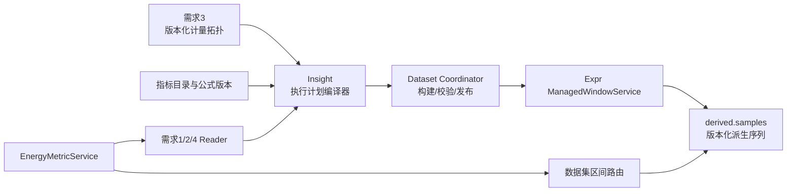

方案 A 我会设计成“Insight 控制面 + Expr 窗口执行面”，且只把必须物化的实时指标交给 Expr。



**1. 职责划分**

Insight 负责所有业务语义：

- 指标定义、适用物模型、组件身份和 readiness。
- 按业务时间读取需求 3 的拓扑版本。
- 将拓扑展开为叶子表具、输入/输出系数。
- 生成执行计划、管理数据集版本和发布切换。
- A1–A3、周期 B1–B5 的即时查询。
- 需求 6 的目录、可选状态和引用校验。

Expr 只负责通用执行能力：

- 按窗口调度和时间对齐。
- 迟到回扫、幂等重算、watermark 和 HA。
- 按冻结计划计算，不查询或解释拓扑。
- 将结果版本化写入 `derived.samples`。
- 返回窗口完成、缺失、失败和修复状态。

**2. 哪些指标进入 Expr**

只物化：

- C1：实时功率、实时流量、实时冷量等。
- 实时 B1–B5：PUE、CLF、PLF、OLF、WUE。

不物化：

- A1 用量、A2 总成本、A3 分时成本。
- 周期 B1–B5。

后者由 Insight 查询需求 2/4 的权威事实，按查询区间的拓扑版本分段计算，避免产生第二份事实。

**3. 冻结执行计划**

不让 Insight 调用现有面向 Builder 的 `UpdateExpression`，而是给 Expr 增加独立的 `ManagedWindowService`。每份计划至少包含：

```text
plan_id
owner = energy.metric
target_ref
metric_ref
formula_version
topology_version
metering_fingerprint
dataset_version
effective_range
window / delay_tolerance / rescan_horizon
inputs[] = source_series + coefficient + unit
formula_dag
output_series
source_fingerprint
```

`inputs` 已经是 Insight 展开的确定输入，例如：

```text
对象实时电功率
= 表具A功率 × 1
+ 表具B功率 × 1
+ 表具C功率 × -1
```

Expr 不知道“输入/输出”“计量对象”“PUE”等概念，只认识输入序列、系数、函数和输出序列。

**4. 数据集发布**

拓扑发布后不直接覆盖线上结果：

```text
拓扑版本发布
-> 创建 BUILDING dataset
-> 编译 Managed Plans
-> Expr 重算该版本生效区间
-> 校验窗口覆盖和失败状态
-> 原子切换数据集路由
-> 旧数据集保留
```

因为需求 3 是时间版本化拓扑，不能只有一个全局 `ACTIVE` 指针，需要区间路由：

```text
scope + metric_family + [effective_from, effective_to)
    -> active_dataset_version
```

处理规则：

- 修改历史版本：只重建并切换该历史版本的生效区间。
- 修改当前版本：重建其生效日至当前，并追平最新窗口后切换。
- 新建未来版本：提前编译，生效日开始执行，不回算。
- 仅 `supplyPower` 变化：不改变 `metering_fingerprint`，不触发指标重建。

**5. 失败与恢复**

- BUILDING 失败时继续读取旧数据集，不暴露半成品。
- Expr 重试使用相同 `plan_id + dataset_version + slot`，保证幂等。
- 数据集增加发布 epoch，旧任务完成后不能反向覆盖新版本。
- Insight 暂时不可用时，Expr 继续执行已发布计划。
- Expr 不可用时，A1–A3 和周期 B 仍可查询；实时指标返回明确的运行状态，不用旧值冒充最新值。
- 数据集成功切换后，旧计划停止产生新窗口，但历史结果继续保留。

**6. 需求 6 的边界**

需求 6 只读 Insight 的目录和 readiness：

```text
SELECTABLE
WAITING_CONFIGURATION
INVALID_REFERENCE
```

“配置可选”和“运行时有值”严格分离。Expr 某个窗口失败不能把指标改成“待配置”；它只影响查询结果的 `NO_DATA/FAILED/PARTIAL` 状态。

我认为这里最关键的设计决策是：**新增独立的 `ManagedWindowService`，并采用按拓扑生效区间的数据集路由，而不是复用面向 Builder 的表达式接口和单一 ACTIVE 指针。**这两个点你是否认可？

关键点是：**Expr 不需要理解“拓扑变更”这个业务概念。Insight 必须把拓扑变更翻译成一份新的、不可变的计算计划。**

例如历史拓扑原来是：

```text
2026-07-01 ～ 2026-08-01
园区A功率 = 电表1 + 电表2 - 光伏表
```

后来用户把这段历史改成：

```text
园区A功率 = 电表1 + 电表4 - 光伏表
```

Insight 完成以下动作。

**1. 生成新的计划版本**

```text
plan_id          = 园区A/实时电功率/topology-v2/revision-4
effective_from   = 2026-07-01
effective_to     = 2026-08-01
mode             = RECOMPUTE_ONLY

inputs:
  电表1功率序列，coefficient = +1
  电表4功率序列，coefficient = +1
  光伏表功率序列，coefficient = -1

formula           = sum(inputs)
output_series     = 园区A/实时电功率
```

Expr 看到的只是：

```text
在指定时间范围内
读取三条输入序列
乘各自系数后求和
写入指定输出序列
```

它不知道什么是园区、计量对象、输入表、输出表或拓扑版本。

**2. Insight 下发重算命令**

```text
UpsertWindowPlan(newPlan)

RecomputeWindowPlan(
  plan_id = newPlan,
  from = 2026-07-01,
  to = 2026-08-01
)
```

历史计划设置为 `RECOMPUTE_ONLY`，不会参与当前实时调度。只有当前生效拓扑对应的计划是 `SCHEDULED`。

**3. Expr 按新计划重算**

Expr 对每个窗口执行：

```text
读取窗口边界上的电表1、电表4、光伏表数据
-> 计算新结果
-> 使用更高 write_version 写入 output_series
```

`derived.samples` 是版本化写入，因此同一时间槽的新版本会取代旧版本。旧版本仍保留用于审计，但普通查询只读当前有效版本。

**4. 当前和历史计划互不干扰**

假设拓扑时间线是：

```text
v1: 2026-01-01 ～ 2026-07-01
v2: 2026-07-01 ～ 2026-08-01
v3: 2026-08-01 ～ 当前
```

修改 `v2` 时：

- 只更新 `v2` 对应的 Expr 计划。
- 只重算 `v2` 的有效区间。
- 当前正在运行的 `v3` 计划继续正常产出。
- 不需要停止当前实时计算。

**5. 变更事件由 Insight 消费**

完整流程是：

```text
需求3保存拓扑版本
-> outbox: TopologyVersionChanged
-> Insight MetricPlanCompiler
-> 展开新拓扑的叶子和正负系数
-> 生成不可变 WindowPlan
-> 下发 Expr
-> 发起有效区间重算
-> 轮询/接收窗口完成状态
-> 标记重算成功或失败
```

如果只是 `supplyPower` 变化，Insight 比较 `metering_fingerprint` 后发现计量拓扑没有变化，直接跳过 Expr。

**必须增加的最小能力**

现有 Expr 只有一个可变表达式定义，不足以重放历史拓扑。最小扩展应是：

```text
WindowPlan
- plan_id
- plan_revision
- effective_range
- inputs
- formula
- output_series
- execution_mode: SCHEDULED | RECOMPUTE_ONLY
```

核心原则可以概括为：

> Insight 理解拓扑变化，并冻结“当时应该怎样算”；Expr 只理解一份带时间范围的计算计划，绝不在执行或重算时重新查询当前拓扑。

需要改，但**不需要重写 Expr 的窗口运行时**。方案 A 的改造集中在“任务控制面”，现有 WINDOWED 计算能力大部分可复用。

**必须改的部分**

1. 增加受管任务身份：

```text
owner = energy.metric
plan_id
plan_revision
topology_version
```

用于区分 Insight 下发的任务和 Builder 人工表达式，并禁止人工修改。

2. 输出序列与物模型属性解耦：

```text
output_series = energy_metric/{target}/{metric}
```

当前表达式主要绑定模型/实例属性；需求 5 的指标不能伪装成物模型测点。

3. 区分调度模式：

```text
SCHEDULED       当前拓扑计划，持续计算
RECOMPUTE_ONLY  历史拓扑计划，只在指定范围重算
```

否则历史拓扑计划也会持续运行。

4. 重算绑定明确的计划版本：

```text
RecomputeExpression(
  plan_id,
  plan_revision,
  from,
  to
)
```

不能只按当前表达式重算，否则修改历史拓扑时会错误使用最新拓扑公式。

5. 写入增加版本围栏：

```text
write_id = plan_revision + slot_start + input_fingerprint
```

旧计划或过期 worker 的结果不能覆盖新计划结果。

**可以直接复用的部分**

- WINDOWED 窗口调度。
- `delay_tolerance` 和迟到回扫。
- watermark、窗口台账和状态查询。
- HA 与任务恢复。
- `derived.samples` 版本化写入。
- `RecomputeExpression` 的主体执行逻辑。

**不应该放进 Expr 的内容**

- 拓扑查询和版本判断。
- 输入/输出计量方向解释。
- 指标目录和 readiness。
- PUE、CLF 等能源业务定义。
- 哪些对象受拓扑变更影响的判断。

这些全部留在 Insight。

因此改造量可以控制为：

```text
Proto/任务元数据扩展
+ 受管任务保存与权限隔离
+ output_series 支持
+ SCHEDULED/RECOMPUTE_ONLY 调度开关
+ 重算版本围栏
```

窗口计算核心不用动。完全不改 Expr 也能通过“虚构属性、一个拓扑版本建一个表达式”勉强实现，但会污染物模型属性、暴露给 Builder，并且历史重算容易误用当前表达式，不建议采用。