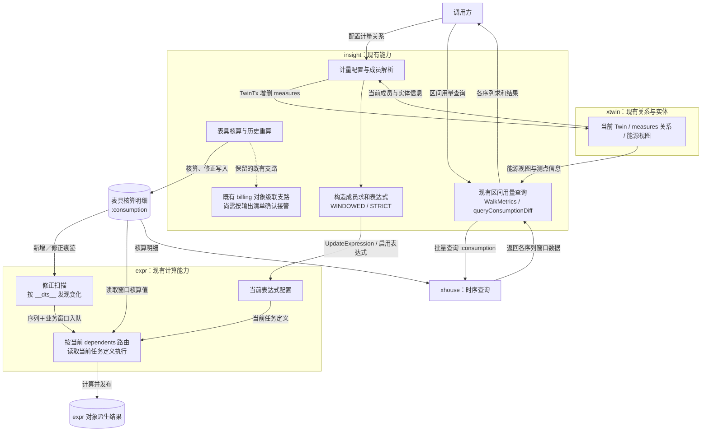
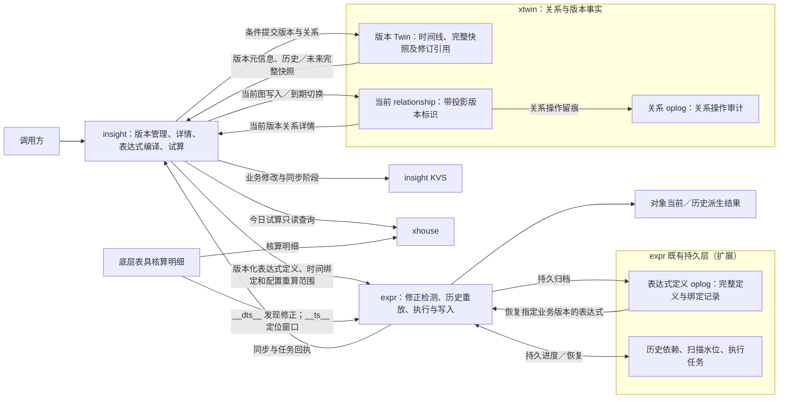
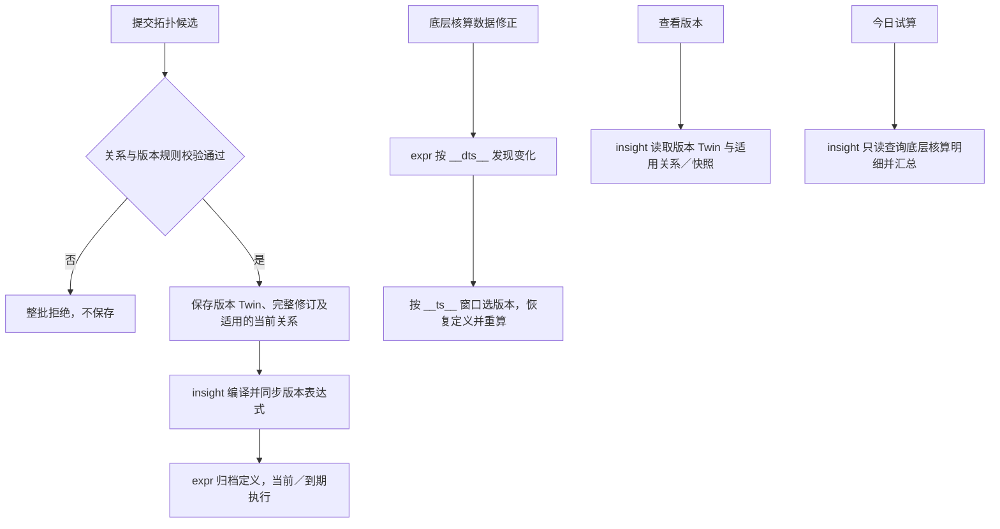
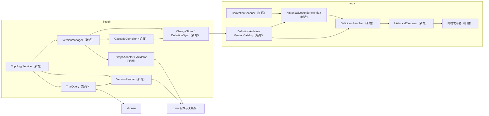
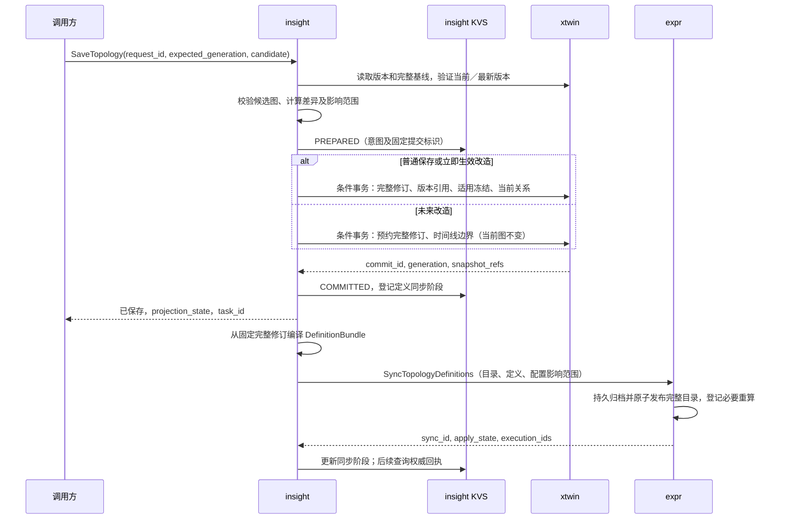
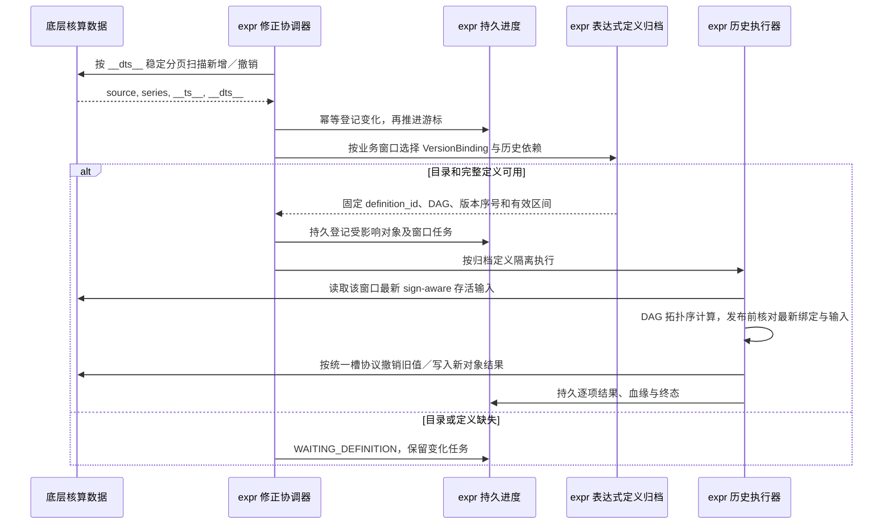
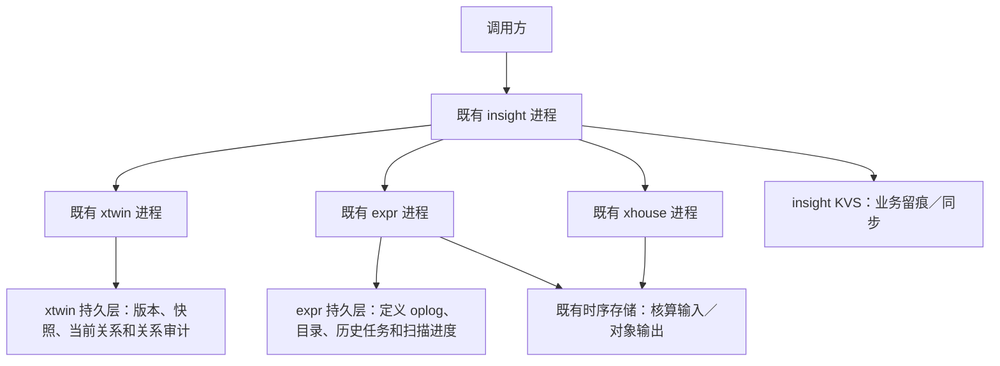

# 能效 2.5 拓扑关系 技术 / 架构设计 v1.1

> **文档定位**：结果态技术草案 v1.1。根据本轮职责调整重新整理完整方案，供开发、接口对接和验收评审；不代表相关依赖已经实现或通过最终架构评审。v1.0 保留为演进记录。
>
> **核心分工**：xtwin 保存版本 Twin 与当前 relationship；insight 管理版本、查询完整拓扑、构造表达式和今日试算；expr 保存版本化表达式定义，检测底层数据修正并自主重放历史表达式、计算及写入对象结果。
>
> **oplog 口径**：本稿将计算链路中的 oplog 明确定义为 **expr 的表达式定义变更记录**，不是 xtwin 的原始关系日志。expr 恢复已编译定义，不重新解释业务关系；关系日志继续用于关系审计。此为本稿采用的技术设计，具体持久化与接口仍需服务 owner 评审。
>
> **范围**：F13–F37；F01–F12 暂缓。保留 v1.0 的章节结构；关键缺口汇总于 §2.3，第9章给出决策门禁。

[TOC]

---

## 0. 变更记录

| 序号 | 变更时间 | 变更人 | 主要变更 | 版本 |
| --- | --- | --- | --- | --- |
| 1 | 2026-09-23 | Codex（依据需求整理） | 形成初版并按指定技术架构模板整理。原文保留，不在本文件回写。 | v1.0 草案 |
| 2 | 2026-09-23 | Codex（依据本轮确认整理） | 版本详情改为版本 Twin 与当前关系／版本完整快照；修正扫描和历史重放下沉 expr；区分关系日志与表达式定义日志；同步调整模型、流程、接口、迁移和验收。 | v1.1 草案 |
| 3 | 2026-09-23 | Codex（按本轮确认补充） | 在背景章节增加当前现状图及与目标能力的差别，明确既有修正扫描和区间查询的边界。 | v1.1 草案 |

### 0.1 相对 v1.0 的实质变化

| 方面 | v1.0 | v1.1 采用的设计 |
| --- | --- | --- |
| 版本详情 | insight 重放版本检查点后的关系事件获得最终拓扑 | 当前版读取版本元信息与匹配代次的 relationship；历史／未来版直接读取版本 Twin 引用的完整快照。 |
| 版本快照 | 初始 checkpoint 不变，后续修改依赖 edit_commits 恢复 | 每次普通保存持久化新的完整 SnapshotRevision；版本指向最新修订；历史冻结最终引用，未来保存预约快照。 |
| 数据修正发现 | insight 的 CorrectionCoordinator 扫描 __dts__ | expr 扩展既有修正检测，自主登记变化、选择定义、计算和恢复。 |
| 历史重放输入 | xtwin 原始关系 oplog，由 insight 恢复关系再编译 | expr 表达式定义 oplog 中的不可变完整定义与版本绑定；不是按日志物理时间回滚关系。 |
| 历史编译 | 每次数据修正由 insight 重新构造历史 DAG | insight 在拓扑提交后编译并同步；expr 对数据修正复用已归档定义。 |
| 任务持久化 | insight 保存扫描水位、历史计划及执行编排 | insight KVS 只保存业务修改和同步进度；expr 保存扫描水位、定义归档、历史依赖与执行任务。 |
| xtwin 前置 | 条件事务＋完整原始关系重放协议 | 条件事务＋完整版本快照及一致读取；原始关系重放 API 不再是本需求计算链路的前置。 |

# 1. 引言

## 1.1 目的

建立可指导后端开发、跨服务对接与测试的能源级拓扑版本方案。**版本和关系由 xtwin 提供事实，insight 解释业务关系并编译，expr 解释已编译定义并执行。** 版本详情查询不依赖计算重放；表具历史数据修正不需要 insight 再接收事件或生成逐窗口计划。

仅调整技术文档，不实施业务代码。F01–F12 的配置入口、成员维护、组件能力验证、双关系操作及批量配置仍暂缓；保存接口只约定规范化候选整体图。

## 1.2 背景

### 1.2.1 已有能力与本稿缺口

下表沿用 v1.0 的代码现状证据，不将既有局部能力等同于完整 v1.1 能力；路径相对工作区根目录。

| 证据 | 参考位置 | 已有能力与缺口 |
| --- | --- | --- |
| C01 | `xtwin-insight/internal/energy/measures/resolver.go` | measures 以成员 → 聚合点存储；需要显式适配业务方向、能源与输入／输出属性，不能直接反转旧边。 |
| C02 | `xtwin-insight/internal/energy/service/measures_edges.go`；`xtwin/api/twins/v3/tx.proto` | TwinTx 可提交 Twin 与关系变更；本稿所需 generation 条件、幂等提交与版本快照一致性仍需补齐。 |
| C03 | `xtwin-insight/internal/energy/service/usage_srv.go` | 已构造成员求和 WINDOWED 表达式并投递 expr；需要多层带符号编译和完整版本定义归档。 |
| C04 | `xtwin-expr/internal/expr/window/correction.go`；`xtwin-expr/internal/expr/window/ckstore/ckstore.go` | 已按 __dts__ 发现修正，现有路由依赖当前 dependents；需要历史依赖、稳定游标和纯撤销发现。 |
| C05 | `xtwin-expr/internal/expr/window/runtime.go`；`xtwin-expr/internal/expr/service.go` | 现有 RecomputeExpression 入队后读取当前任务，不支持直接恢复独立历史定义；入队数不代表完成。 |
| C06 | `xtwin/internal/twins/oplog.go`；`xtwin/api/oplog/v1/oplog.proto` | 关系日志和展示型 ListOplog 不是表达式版本归档；v1.1 不将其接入计算重放。 |
| C07 | `xtwin-insight/internal/energy/recompute/store.go`；`xtwin-insight/internal/energy/recompute/manager.go` | 已有 KVS 持久任务参考；普通 Set 和进程锁不能提供跨实例 CAS。 |
| C08 | `xtwin-insight/internal/energy/service/service.go` | queryConsumptionDiff 已通过 xhouse 查询 :consumption 核算槽；新试算仍需完整性判断和原始精度。 |
| C09 | `xtwin-insight/internal/energy/billing/billing_types.go` | 存在旧对象级级联写路径，接管后必须按输出序列切换为 expr 单一写方。 |
| C10 | `xtwin-expr/internal/expr/window/runtime.go`；`xtwin-expr/internal/expr/biz/dao/correction_scan.go` | 已有存活值回查、撤销重写及修正扫描水位；需扩展持久历史定义、发布门禁和任务回执。 |
| C11 | `xtwin-insight/internal/energy/service/reminder.go`；`xtwin-insight/internal/energy/service/platform_access.go` | 窗宽／延迟容忍与 billing 同源，已有权限上下文处理可参考。 |

### 1.2.2 当前现状图：关系配置、表达式计算与用量查询

下图展示当前工作区代码已有的相关链路，与 §1.3.1 的 v1.1 目标架构区分。能源级版本 Twin、完整版本快照和表达式历史归档不作为已实现能力绘入本图；既有 billing 对象级联支路仍保留，不能据此认定已经完成统一写方接管。



现状与目标的主要差别：

1. **已有 insight 构造表达式、expr 执行的链路。** 当前这里构造的是成员核算用量求和，尚不是 v1.1 的完整版本化拓扑编译，见 C03。
2. **expr 已检测 __dts__，但仍使用当前依赖和当前任务定义。** v1.1 需要补齐业务版本绑定、历史依赖和历史表达式恢复，不是从零新增修正扫描，见 C04、C05。
3. **已有只读区间用量查询，但不是完整的今日拓扑试算。** 当前对各序列核算槽求和；v1.1 还需接入候选拓扑、输入／输出系数展开，以及 COMPLETE/PARTIAL 等完整性结果，见 C08。

图中关键代码定位：`xtwin-insight/internal/energy/service/usage_srv.go:1448`（表达式构造）、`xtwin-expr/internal/expr/window/correction.go:133`（当前依赖修正路由）、`xtwin-expr/internal/expr/window/runtime.go:513`（读取当前任务执行）、`xtwin-insight/internal/energy/service/service.go:177`（区间用量查询）。

### 1.2.3 采用的边界

- insight 不再维护自动修正扫描器、关系 HistoryResolver 或逐窗口历史执行计划；它在保存、初始化、克隆或定义修复时编译完整快照。
- expr 不读取关系 oplog 来猜测拓扑；历史定义缺失时等待定义同步，不回退当前表达式。
- 当前 relationship 只表示当前投影，不能拼接到历史或未来版本；版本 Twin 必须能独立提供那些版本的完整详情。
- 采用版本化完整表达式定义归档，不要求从第一条表达式修改日志重演到现在；物理上复用 expr 既有持久层，不引入外部消息总线。

## 1.3 项目概述

每个 namespace、每种能源只有一条整体时间线。普通保存更新当前版本，线路改造追加版本，未来版本到期切换。insight 从版本事实取得完整拓扑并编译版本化表达式，expr 保存定义和时间绑定后承担当前计算及历史修正。今日试算由 insight 经 xhouse 只读查询底层核算明细并计算返回。

### 1.3.1 零层架构图（目标态）

下图箭头表示主要数据流；版本和关系的服务端事实均归 xtwin，表达式归档与执行状态归 expr。



图中的两种 oplog 不可混用：**关系 oplog 不承担 expr 历史表达式恢复；表达式定义 oplog 不承担 insight 版本详情恢复。**

## 1.4 术语

| 术语 | 标识 | 含义 |
| --- | --- | --- |
| 时间线范围 | scope | (namespace, energy_type)，namespace 来自认证上下文。 |
| 业务版本 | version_id | 线路改造生成的能源级整体版本，区间左闭右开。 |
| 版本内修改序号 | edit_seq | 普通保存递增；同一版本最新口径追溯整个版本区间，历史版冻结最终序号。 |
| 提交代次 | generation | scope 内条件提交和同步排序标识；不是所有历史任务一概失效的依据。 |
| 完整拓扑修订 | SnapshotRevision / snapshot_ref | xtwin 内不可变完整快照，含两类关系和计算绑定；版本 Twin 指向适用修订。 |
| 当前关系投影标识 | graph_projection | 当前 relationship 对应的 version_id/edit_seq/generation，用于一致查询。 |
| 表达式定义 | DefinitionBundle / definition_id | insight 编译的不可变完整 DAG、输入输出绑定和编译器版本；expr 持久保存。 |
| 表达式定义日志 | ExpressionDefinitionLog | expr 对完整定义归档和版本绑定变更的持久记录；本稿计算链路中的 oplog。 |
| 版本计算绑定 | VersionBinding | 将 version_id/edit_seq、snapshot_ref、有效区间绑定到 definition_id；当前版选择最新序号，历史版选择冻结序号。 |
| 数据业务时间 | __ts__ | 核算槽的窗口终点，用所属业务窗口选择版本。 |
| 数据写入时间 | __dts__ | 发现新写入／修正并推进扫描水位，不决定业务版本。 |
| expr 执行任务 | execution_id | expr 自建的持久重算任务，冻结执行上下文，包含逐对象逐窗口结果。 |

## 1.5 引用文件

1. `xtwin-insight/doc/能效2.5/拓扑关系/需求3拓扑需求澄清与功能清单v1.0.md`：F13–F37 与已确认业务规则。
2. 同目录 `需求3拓扑关系技术方案v1.0.md`：前版代码证据、原设计和模板组织；与本稿冲突的职责和数据模型以 v1.1 为准。
3. `xtwin-insight/AGENTS.md`：数据主权、Proto、权限、LRO 与持久化约束。
4. 本轮确认：版本详情由版本 Twin 与关系事实提供；底层数据修正的发现和重放执行下沉 expr；保留 insight 编译表达式、expr 执行的分工。

# 2. 架构目标与设计约束

## 2.1 功能需求

### 2.1.1 零层业务流图



### 2.1.2 关键功能

| 规则 | 功能 | 处理规则 | 需求 |
| --- | --- | --- | --- |
| K1 | 保存前校验 | 同版候选整体图校验占用、方向、自环、环路、父级、重复覆盖与叶子系数；包含受影响上级，失败整批拒绝。供电独立校验。 | F13–F18 |
| K2 | 版本时间线 | 每能源整体版本，日粒度，左闭右开；新版本只能末尾追加且日期严格晚于最新版本；首版日期2020-01-01。 | F19、F20、F22 |
| K3 | 历史与未来 | 历史只读、版本不删除；未来保存完整预约快照，不提前改当前关系或重算，到期冻结旧版最终修订并切换。 | F21、F23–F25 |
| K4 | 两种保存 | 普通保存只增当前版 edit_seq；计量变化追溯本版起点。改造新增版本，从新生效日起重算；未来版等待生效。 | F26、F27 |
| K5 | 保存与执行 | xtwin 条件提交为保存成功边界；expr 同步／计算失败不回滚版本，保留可恢复同步和执行记录。 | F28 |
| K6 | 历史计算 | expr 用 __dts__ 发现修正，用 __ts__ 的业务窗口选版本，再恢复该版本的表达式定义；不调用 insight 逐窗编译。 | F33、F35、F36 |
| K7 | 影响面 | 配置变化取修改前后相关对象及上下游并集；数据修正取历史依赖。供电和 branchn 不参与能耗计算，单独修改不重算。 | F33、F34 |
| K8 | 留痕与详情 | insight KVS 留业务修改；当前详情取一致版本与当前关系，历史／未来取完整快照；差异无需关系日志重放。 | F29 |
| K9 | 克隆 | 导出整条时间线与各版最终完整计量／供电关系，不复制样本和能耗结果；目标建立独立快照并重新编译表达式。 | F30、F31 |
| K10 | 今日试算 | insight on-read 读取叶子核算明细，按符号系数计算，不调用 expr、不保存；区分完整零值、负值、缺数和无关系。 | F32 |
| K11 | 整体冻结 | 局部改造冻结整个能源旧版，其他对象也不能改旧版关系；历史表具数据仍可修正并按冻结口径重算。 | F37 |

## 2.2 质量需求

| 维度 | 要求 | 设计与验证 |
| --- | --- | --- |
| 正确性 | 详情不串版本，计算不混用两种时间，不将缺数当零。 | §3.2；跨版、边界窗口、解绑后修正和快照冻结测试。 |
| 一致性 | 版本、快照和当前图一致提交；expr 投影异步可恢复。 | §3.2.4；事务失败、提交后断连、乱序同步和恢复测试。 |
| 独立运行 | 定义已同步且授权有效时，insight 停机不阻断 expr 对既有版本的修正处理。 | 停止 insight 后修正历史输入，确认 expr 完成且不回调编译。 |
| 并发与幂等 | 同代次配置仅一方提交；同槽发布互斥，旧任务不覆盖新口径。 | scope 条件提交、版本绑定比较、输入水位与 sign-aware 写入测试。 |
| 性能与容量 | 基础图遍历 O(V+E)，路径诊断及展开成本单独测量；批量查询、有界缓存和 worker。 | 第12章给出量级变量，不编造吞吐或耗时结果。 |
| 安全与可观测 | scope 隔离、后台重新授权，能关联配置、定义和执行。 | 第5、6章；越权、重启及故障定位验收。 |

## 2.3 约束

1. 保留业务规则与 F01–F12 暂缓范围；不新增历史解锁、对象独立版本或版本删除。
2. 不新增服务、数据库产品、消息总线或通用任务框架；复用 xtwin、insight、expr、xhouse 及各自持久层。
3. gRPC/proto-first，HTTP 从注解派生；不直接读写对方数据库，不手改生成代码。
4. insight 是受管关系的业务写入口；expr 是接管对象结果的唯一写方；不复制表具清洗、累计读数求差和计价算法。
5. 表达式定义日志为本稿拟新增能力，不将现有 xtwin ListOplog 或 RecomputeExpression 解释成已经支持。
6. 版本事实保存在 xtwin；KVS 业务审计不成为第二套当前图；expr 定义归档是可由版本快照编译重建的计算投影。

| 待确认项 | 缺口与影响 | 本稿处理 |
| --- | --- | --- |
| Q-T01 | relationship kind、方向／能源属性、稳定实体与序列绑定 | 使用显式 GraphAdapter，模型映射确认前不反转旧 measures。 |
| Q-T02 | xtwin 条件事务、完整修订、冻结及一致读取 | 按 §4.3.2 拟扩展；普通 KVS Set 不代替服务端条件。 |
| Q-T03 | expr 定义归档、版本绑定、历史依赖、修正扫描和隔离发布 | 按表达式定义 oplog 设计，具体持久化及同步失联策略须评审。 |
| Q-T04 | 业务时区与核算窗对齐 | 必须明确；不对跨界槽按比例臆分电量。 |
| Q-T05 | 克隆载体、身份映射和目标冲突 | 建议首期只导入空目标，禁止未确认的隐式覆盖。 |
| Q-T06 | 首版基线与历史覆盖、定义归档保留政策 | 2020-01-01 不证明真实历史可恢复；按获准基线明确覆盖范围。 |

这些待确认项不重新征求已明确的职责方向；owner 的实现评审及门禁见第9章。

# 3. 架构设计

## 3.1 逻辑视图

### 3.1.1 模块职责



insight 拟新增 `internal/energy/topology/`，按 version、graph、compiler、definition_sync、change_store、trial 拆分；不再新增 v1.0 的 history/correction 编排模块。expr 在既有窗口运行时内扩展定义归档、历史依赖及执行，具体文件划分实施时确定。

| 责任方 | 负责 | 不负责 |
| --- | --- | --- |
| insight VersionManager / VersionReader | 版本业务规则、完整快照、当前图切换、详情／差异／克隆 | 不通过关系 oplog 拼历史详情，不扫描底层修正。 |
| insight GraphAdapter / CascadeCompiler | 图校验、关系解释、完整 DAG 编译、配置变化影响面 | 不按每次表具修正重复编译，不直接写对象结果。 |
| insight DefinitionSync / ChangeStore | 保存意图、提交对账、固定定义同步重试、业务任务状态 | 不持有 expr 的扫描水位和逐槽执行权威状态。 |
| insight TrialQuery | 批量查询核算明细、叶子系数与质量结果 | 不创建 expr 配置／任务，不保存候选或试算结果。 |
| xtwin | 时间线、版本完整修订、当前 relationship、事务与关系审计 | 不编译表达式，不扫描表具修正。 |
| expr | 定义持久化、时间绑定、历史依赖、修正发现、隔离计算与结果写入 | 不解释关系 kind、不编译业务拓扑、不修改版本 Twin。 |
| xhouse / 原表具核算链路 | 统一读取／底层表具核算事实 | 不接管拓扑版本管理。 |

### 3.1.2 图校验与共用编译规则

1. 设备和组件统一用稳定实体标识；设备树父子关系不自动成为计量边，不能用组件宿主替代组件。
2. 按 F14 校验表具与能源的归属占用，输入／输出共用名额，同对象同表具不能同时输入和输出；保留需求允许的相邻对象上级输出／下游输入，不把这类连接误判为非法重复。具体关系映射由 Q-T01 固化。
3. 拒绝自环和有向环并返回完整冲突路径；同能源、同方向的成员对象只有一个直接上级。
4. 已选子对象时，不再选其后代或已覆盖叶子。输入边 +1、输出边 -1，路径符号相乘、多路径系数相加；叶子最终系数绝对值大于1拒绝。不能用正负抵消掩盖非法重复覆盖。
5. 供电仅检查源端能力、端点有效性和同向重复；供电／branchn 不进入计量编译。
6. 每个对象生成 E(object,T)=Σ sign(edge) × E(member,T)。叶子固定读取核算后的 :consumption，子对象依赖使用同一窗口、同一版本上下文。
7. DefinitionBundle 包含完整受管对象集合、显式依赖和稳定输入／输出绑定，不使用随当前图变化的 walk 选择器。无关系对象显式标记 NO_RELATION，配置变化时产生撤销旧结果的范围，不创建空求和零值表达式。
8. 版本详情、编译和试算共用同一关系解释规则；历史执行只消费已编译结果，不在 expr 复制 GraphAdapter 或业务校验器。

### 3.1.3 领域与状态模型

| 对象 | 所有者 | 主要内容及生命周期 |
| --- | --- | --- |
| TopologyTimeline | xtwin；insight 授权写入 | scope、generation、按日期排序的版本、提交引用和当前图投影标识。 |
| TopologyVersion | xtwin | 生效区间、最新 edit_seq、snapshot_ref、说明；历史冻结最终引用，未来指向预约快照。 |
| SnapshotRevision | xtwin | 不可变完整两类关系、绑定、时区、窗宽和编译语义标识；至少保留历史详情和未完成同步所需修订。 |
| TopologyChange | insight KVS | request_id、操作者、提交意图、事实结果及定义同步阶段。 |
| DefinitionBundle | expr；insight 编译供给 | definition_id、不可变完整 DAG、stable bindings、compiler_version；相同 ID 不接受不同内容。 |
| VersionCatalog | expr | 应用到的 generation、各业务版本最终／当前绑定及区间；可从已接收日志重建。 |
| ExpressionDefinitionLog | expr | 完整定义记录和有序版本绑定提交；包含完整性标记，不是仅有自然语言摘要的审计。 |
| RecomputeExecution | expr | 原因、固定版本绑定、窗口集合、输入水位、逐项状态及结果血缘。 |

| 对象 | 状态 | 判定与允许行为 |
| --- | --- | --- |
| 业务版本 | SCHEDULED / ACTIVE / HISTORICAL | 按 now 与业务区间推导；未来只读等待、当前可普通保存、历史只读；不取决于表达式是否已同步。 |
| 业务修改 | PREPARED / COMMITTED / ABORTED | 意图已存／xtwin 已提交／确认未提交而终止；未知提交结果不能直接判 ABORTED。 |
| 关系投影 | PENDING / READY / FAILED | 当前图是否与业务当前版最终修订一致；延迟不延长旧版有效期。 |
| 定义同步 | PENDING / READY / FAILED | expr 是否完整持久化并应用指定目录绑定；READY 不代表历史计算已完成。 |
| expr 执行 | PENDING / RUNNING / WAITING_DEFINITION / SUCCEEDED / FAILED / SUPERSEDED | 缺目录或定义等待；输入读取失败记录逐项失败；全部项完成才成功；过期口径禁止发布并被替代。 |

### 3.1.4 核心决策表

| 条件 | 动作 | 边界 |
| --- | --- | --- |
| 当前版普通保存，计量变化 | 原子更新当前图、新完整修订和 edit_seq；编译同步；expr 重算本版起点至固定截止窗。 | 不新增线路版本，不突破本版起点；之后新窗走当前任务。 |
| 普通保存仅供电变化 | 记录完整修订和审计；同步版本绑定，可复用相同 definition_id。 | 不建能耗重算任务。 |
| 过去／今天生效改造 | 冻结旧版最终修订、追加完整新版本、切换当前图；同步目录及新定义。 | 新区间按新口径；旧在途任务必须重新检查区间归属。 |
| 未来改造 | 保存完整预约快照与表达式安排，提前同步目录和边界。 | 不改当前图、不立即冻结旧版、不提前计算。 |
| 已有未来版后继续普通保存 | 仅更新 ACTIVE 的完整修订与表达式绑定。 | 未来快照不自动重基；下一次改造仍只能从最新版本末尾追加。 |
| 表具历史修正 | expr 扫描变化，定位业务版本和历史依赖，恢复定义并计算。 | 不回调 insight 编译，不查当前关系猜测历史。 |
| 版本存在但表达式未齐 | expr 登记 WAITING_DEFINITION，定义同步后重试。 | 不使用当前定义替代，不把等待当零值或完成。 |

## 3.2 运行架构

### 3.2.1 服务划分与依赖方向

insight → xtwin 读写版本关系；insight → expr 同步已编译定义和查询执行回执；insight → xhouse 今日试算。expr → 核算数据读取修正与存活值，expr → 自身归档恢复历史定义。**数据修正主链路不经过 insight，也不依赖 xtwin 关系 oplog。**

expr 只理解传入的业务版本区间与不可变计算绑定，不自行决定线路改造日期。insight 可展示 expr 任务，但展示或轮询不是执行前提。

### 3.2.2 版本详情读取

| 请求版本 | 读取来源 | 一致性规则 |
| --- | --- | --- |
| ACTIVE | Version Twin 元信息＋当前 relationship | graph_projection 必须匹配目标 version_id/edit_seq，并与读取 generation 一致。 |
| HISTORICAL | Version Twin 的冻结 snapshot_ref | 返回完整计量／供电关系和当时绑定，不拼接当前关系。 |
| SCHEDULED | Version Twin 的预约 snapshot_ref | 返回保存时完整快照，不吸收当前版后续修改。 |

当前详情采用服务端一致读取，或读取 generation／投影标识 → 读取完整关系 → 再读同一标识的校验协议；变化则有界重试。分页必须固定读取代次，不能将多次提交的边拼成一张图。

若已跨生效日但当前图未切换，返回业务当前版完整快照，并标明 snapshot_source=VERSION_SNAPSHOT、projection_state=PENDING/FAILED；不得把旧图冒充新详情。名称可补当前展示值，计算身份和序列绑定必须取所选修订。

版本差异比较两个版本最终完整快照；导出固定 source_generation，当前版也固定 snapshot_ref。查询、差异、导出和今日试算不依赖关系日志或 expr 定义日志。

### 3.2.3 保存、冻结与未来切换



1. NORMAL 的 base_version_id 必须为按服务器业务时间判断的 ACTIVE；RENOVATION 的基线必须为时间线最新版本。条件事务同时验证 generation、base_edit_seq 和日期条件，不能仅在请求开始时检查。
2. 普通保存生成新的不可变完整 SnapshotRevision，并在同一事务更新当前关系、版本 edit_seq/snapshot_ref、提交引用和幂等结果。编译可在提交前预检，但只有已提交修订允许投递 expr。
3. 立即生效改造在覆盖当前图前固定旧版最终修订；同一事务内缩短旧版区间、建立新版本和切换图。历史版本已有冻结内容不再改写；合法追加只改变此前末版的结束边界。
4. 未来保存时只登记完整预约快照和后续区间，不冻结当前版的修改序号。当前版仍可修改，未来版内容保持独立。expr 提前收到新定义与边界，到期按业务时间启用；insight 负责当前 relationship 的到期投影。
5. 到期切换与普通保存共用 scope 条件。过了边界，即使切换 worker 尚未运行，旧版普通保存也必须拒绝。旧版最终修订从已提交版本引用获取，不从已覆盖的图补抓快照。
6. 停机跨多个生效日时，只投影 now 所属版本；中间已过期版本直接冻结其保存的完整修订。expr 按各段定义补算，不依次将过去的关系安装到线上。
7. 每次提交记录精确 snapshot_ref、compiler_version 和同步意图；连续两次保存不能让第一次重试误编译第二次的快照。后台从提交引用对账，不依赖某个内存队列存活。
8. xtwin 提交后即为配置成功。KVS 补写、编译或 expr 同步失败都保留事实，按原 request_id 对账恢复；不能以删除版本或回退关系补偿。

**跨服务收敛边界：** xtwin 与 expr 不是原子提交。expr 尚未获知新提交时可能继续使用最后确认的口径；这些结果只能标为旧绑定、待收敛，不能宣称属于新口径。新目录 READY 后，配置影响范围必须补算，旧在途项发布前按最新目录复核。已知未来边界不得越界执行旧定义；新定义缺失则等待。未获知的新边界不能假装已被门禁覆盖；若要求配置提交瞬间即停止全部旧写入，须在 Q-T03 单独评审跨服务发布授权机制，本稿不把异步同步描述成该强保证。

### 3.2.4 事务、并发、抗错、抗重复

| 关注点 | 设计 |
| --- | --- |
| 事实事务 | xtwin 原子提交完整修订、版本引用、关系变更和 request_id 结果；分块快照先完整准备，再原子发布引用，不暴露半快照。 |
| 提交并发 | scope 为粒度，服务端验证 expected_generation；保存、到期切换、目标克隆发布共用条件；进程锁不是跨实例保障。 |
| 同步顺序 | expr 按 generation 应用目录；重复同 ID 同内容返回原结果，旧目录不能覆盖新目录；较新目录需完整覆盖版本头绑定及未收敛配置影响。 |
| 同步幂等 | sync_id 对应一次不可变提交；definition_id 对应不可变内容；归档和受理结果可恢复，不因重试创建不同定义或重复累加。 |
| 执行并发 | 当前任务和历史 executor 共用 canonical output_series/window_end 发布互斥；不能只按 execution_id 加锁。 |
| 过期判定 | 比较该窗口所属 version_id/edit_seq/definition_id 与当前已应用目录；generation 仅控制目录顺序，其他版本保存不应使未变的历史绑定全部失效。 |
| 部分失败 | 校验失败整批拒绝；已提交同步失败只影响计算收敛；执行逐项失败保留成功项，父节点不能越过失败子节点报完整结果。 |
| 抗漂移 | 禁止旧 UpdateMeasurement 等旁路修改受管关系；发现关系与版本标识不一致时告警并停止受影响同步，不将外部变更默认为合法版本。 |
| 重启与取消 | 持久意图、同步和 expr 任务恢复；提交后不提供业务取消，断连不撤销事实。未提交校验／试算使用请求 context。 |
| 权限 | namespace 来自认证；持久任务存稳定 owner 身份但不存 token，恢复执行重新授权。 |

Go 协调器使用服务级 context 管理生命周期，RPC 有界超时和重试；worker 与队列有界，内存队列只作调度提示。退出先停止生产，再取消依赖并等待 worker；如使用 channel，由唯一生产协调方在生产结束后关闭。insight 与 expr 各自恢复本方持久状态，不跨包访问对方内部 map 或 DAO。

### 3.2.5 expr 修正检测、定义重放与历史计算

#### A. 两种时间与业务窗口

| 标识 | 用途 | 不能用来做什么 |
| --- | --- | --- |
| __dts__ | 发现底层核算数据新写入／修正、推进扫描游标 | 不按它选拓扑版本或表达式业务口径。 |
| __ts__ | 标记核算槽窗口终点，确定修正影响的业务区间 | 不能将边界终点直接当成下一版本的第一窗。 |
| effective_from/effective_to | 业务版本有效区间 | 不用表达式归档的物理操作时间替代。 |
| generation / edit_seq | 同步排序／版本内计算口径 | 不表示表具样本发生日期。 |

例一：2026年9月23日修正9月5日核算槽，expr 通过9月23日的 __dts__ 发现，使用9月5日所属版本的定义计算，而非9月23日版本。

例二：V1 从9月1日生效，9月23日普通保存改为 edit_seq=2；9月5日属于 V1，其重算使用序号2。不能按“9月5日当时记录了哪条表达式日志”恢复序号1。V1 被后续版本替代后，最终序号冻结。

设核算窗为 [T-W,T)，时间戳为终点 T。版本 [S,E) 的完整窗口满足 S ≤ T-W 且 T ≤ E。W=30分钟时，10月1日00:00结束的槽属于旧版，00:30结束的槽才属于10月1日新版。日边界必须与窗宽对齐；不对跨边界槽臆分电量。

#### B. 主处理时序



图中 expr 对象结果和底层输入可复用既有时序存储，但序列归属不同；expr 不改写表具核算值。修正执行不调用 insight，也不临时替换当前 Expression 配置。

#### C. 定义归档与恢复

1. insight 对固定 SnapshotRevision 编译完整 DefinitionBundle，携带 compiler_version；expr 不接收“稍后再查当前关系”的动态定义。
2. expr 持久记录 DEFINE_BUNDLE 和 BIND_CATALOG 两类逻辑记录：前者保存完整 DAG，后者保存按版本索引的最终／当前绑定及业务区间。每个同步提交有 manifest，列出定义、绑定和配置影响项；只有全部内容持久化完成才可发布目录。
3. 恢复时先按业务窗口找到 VersionBinding，再按 definition_id 读取完整定义。普通保存选当前版本最新已同步 edit_seq；历史版选冻结序号；不存在按日志物理时间直接截断恢复的规则。
4. 每条完整定义本身即可恢复，不要求依赖无限增长的字段级差量链。日志记录仍保留请求、提交和应用阶段，以便重启重建目录、对账及防止重复受理。
5. 只有关系/供电信息变化但计量定义相同时，可由新 VersionBinding 引用原 definition_id；版本 edit_seq 和说明仍更新，不触发无关能耗重算。
6. 定义、目录或清单不完整时等待；修复由 insight 的定义同步对账基于固定快照重发，不由 expr 回调 insight 临时编译每个窗口。编译器升级不能静默替换已归档定义，须经显式发布及重算范围评审。

#### D. 历史依赖与变化发现

- 从所有已发布版本定义构建历史反向索引，至少索引 source/series、有效业务区间、version_id、edit_seq、依赖输出。当前已解绑的表具仍留有历史订阅，不得只扫描当前 dependents 覆盖的序列。
- 扫描受管定义所引用的底层核算输入；对象输出的级联传播由同一 DAG 控制，不将自身输出再次当成底层修正无穷循环。合法派生叶子按显式源类型和依赖边界订阅，见第8章。
- 扫描覆盖新增行和撤销行，发现“撤销后无新值”的槽；实际输入读取执行 sign-aware 折叠，不能将扫描命中的某条增量行直接累加到旧对象值。
- 游标至少包含 __dts__、source/series、window_end 及同键续页所需稳定标识；同一时间或同一槽的多行不得被 LIMIT 截断后跳过。落库迟到采用经验证的安全重叠与幂等登记，不仅取最大时间后严格大于。
- 变化任务持久化成功后才能推进游标。定义未齐或执行失败不阻塞所有独立任务，但必须保留未完成记录；入队或推进游标不代表计算完成。
- 接入新定义或补齐历史索引后，需要按配置变化范围和初始基线补扫／重算，不能因先前“无订阅”已推进扫描水位而漏掉新归属。定义同步与配置重算登记必须形成恢复闭环。

#### E. 隔离执行、失效结果与同槽发布

| 维度 | 当前执行 | 历史执行 |
| --- | --- | --- |
| 定义 | now 所属业务版本已应用绑定 | 目标窗口所属版本的已归档绑定 |
| 触发 | 正常闭合窗、当前区间内补漏和受控重算 | expr 修正任务或配置变化重算任务 |
| 依赖 | 本版明确 DAG | 该历史上下文的完整局部 DAG，不能读取当前版子对象值 |
| 当前配置 | 由配置同步更新 | 不替换当前配置或当前任务注册表 |
| 发布 | 共用 canonical output_series/window_end 串行发布器 | 与当前任务同槽互斥，不按任务 ID 建平行结果副本 |

1. 正常调度、迟到、补漏、手动重算、上游完成传播都按同一版本区间门禁执行。历史结果不沿当前依赖图跨版本扩散；父子按同一执行上下文拓扑序计算。
2. 发布前重新确认窗口仍属于该 version_id/edit_seq/definition_id；绑定已替换则 SUPERSEDED，并保证新绑定有替代任务。仅全局 generation 增加而该绑定未变时，不无故丢弃有效历史任务。
3. 同槽不同数据修正按统一发布顺序重新读最新输入，比较实际读到的输入水位，不只比较登记任务时的 observed_dts；迟完成的旧计算不得覆盖新输入结果。读到更新输入可合并任务，但保留可核对的处理水位。
4. 复用存活值回查和撤销重写；即使旧窗口已离开内存台账，也先查存活值，避免重复 +1。值相同可免写数值，但业务绑定改变仍更新血缘与任务确认，不能把旧口径伪装成新口径。
5. 配置变化后对象无关系时，显式 RETRACT 旧结果并记录 NO_RELATION；不是补零。输入撤销或缺失时，失效结果不得继续标为完整：撤销／失效标记旧值并记录 INPUT_INCOMPLETE，依赖父节点同样不能报完整结果，待输入恢复重试。
6. EVALUATE 和 RETRACT 项都确认写入或经验证无需重写后才算完成。任务含未解决缺输入项时不能 SUCCEEDED；逐项失败不重做已确认且仍有效的成功项。

### 3.2.6 今日试算 on-read

1. 请求显式选择 SAVED(version_id,edit_seq) 或 DRAFT(完整候选图)，二选一。DRAFT 是接口设计，不额外承诺暂缓的页面功能。
2. SAVED 使用 §3.2.2 的版本读取规则，不读关系 oplog；历史版本试算含义为“按所选历史拓扑计算今天”，不是查询历史日期用量。DRAFT 只在请求内校验和展开，不存版本或 KVS。
3. 固定本次 now、业务时区、当日零点 D 和最近闭合窗口 C，查询 D < __ts__ ≤ C。回显 requested_to=now 与 computed_to=C，不估算未闭合尾窗。
4. 无叶子返回 NO_RELATION；有叶子但 C=D 返回 NO_CLOSED_WINDOW。其余情况经 xhouse 批量读取 :consumption 存活明细，保持原始精度，最后统一格式化。
5. 按路径系数汇总叶子用量，记录 expected_windows、valid_windows、缺失和异常槽。全部完整返回 COMPLETE 与 total，完整全零返回0，负数保留符号；缺数返回 PARTIAL、空 total、partial_total 和明细。
6. 无权限不是缺数，查询依赖故障不是零值；不调用保存、expr 预览、定义同步、执行重试或结果写入。

### 3.2.7 异步任务与完成边界

| 任务 | 权威状态 | 创建、查询及恢复 |
| --- | --- | --- |
| 保存后的定义同步 | insight KVS＋xtwin 提交事实＋expr 同步回执 | 返回 task_id，insight 按原提交同步；READY 仅表明目录与定义已应用。 |
| 配置变化重算 | expr | SyncTopologyDefinitions 受理配置影响项后持久登记，返回 execution_ids；无需等待新表具数据变化才启动。 |
| 表具修正重算 | expr | 扫描自动创建 execution_id；insight 只提供授权查询／展示，不创建第二份扫描任务。 |
| 导出／克隆 | insight 既有 LRO | 沿用项目 Operation 查询约定；metadata 关联本次业务 task_id／阶段，不另建一套导入框架。 |

同步任务关联必要执行子任务；“保存成功”“定义就绪”“必要计算完成”分别展示。GetTopologyTask 从 xtwin/expr 权威回执合成状态，KVS 旧阶段不能覆盖更新执行结果。自动修正任务可由 expr 的列表／详情接口查询，并由 insight 按需代理，不要求先存在保存 task_id。

重算进度以对象×窗口项统计，尚未确定总项时只返回阶段。瞬态故障有界重试，建议每轮最多5次、最大退避60秒，实际值待压测；确定性映射、权限或定义错误不忙等。WAITING_DEFINITION 由归档补齐唤醒，失败项可显式重试，过期项转 SUPERSEDED。提交后不提供取消或版本删除；进程退出暂停处理但不撤销事实。

## 3.3 技术架构

| 层 | 复用能力 | 拟新增／调整 |
| --- | --- | --- |
| API | insight gRPC/Gateway、项目 xerror、既有导入 LRO | TopologyService、版本快照详情、expr 定义同步和执行查询契约。 |
| 版本事实 | xtwin Twin/relationship/TwinTx | 完整 SnapshotRevision、冻结引用、条件事务、一致读取与提交对账。 |
| 编译 | insight 当前 WINDOWED 构造逻辑 | 完整多层带符号 DAG、稳定序列绑定、固定 compiler_version。 |
| 定义归档 | expr 既有持久层 | 完整定义 oplog、目录 manifest、幂等同步和恢复。 |
| 修正运行时 | expr 现有 __dts__ 扫描、窗口执行和存活值读写 | 历史依赖、稳定游标、撤销发现、隔离 executor 和逐槽血缘。 |
| 今日读取 | xhouse QueryMetrics | 叶子批量查询与槽完整性判断，不复制表具核算算法。 |

领域规则与 IO 分离，transport 只转换协议和错误；复用已有客户端、codec 和错误链，不为单次调用引入通用框架。业务错误不使用 panic；context 通过参数传递，不存入长期领域对象。

## 3.4 物理视图



不新增进程或中间件。insight 承担关系到期切换及定义同步补偿；expr 承担表达式到期启用、数据扫描、重算与执行恢复。多实例保存依靠 xtwin 条件提交；expr 复用既有主执行侧模型，共享持久定义与任务。实际部署的主备、共享存储和故障接管须由运维确认，不假设普通 KVS Set 自带排他领取。

| 故障 | 影响与恢复 |
| --- | --- |
| insight 停机 | 暂停业务保存／当前图切换和新定义同步；expr 已完整收到的当前、历史及预约定义可独立执行，权限仍须有效。 |
| expr 停机 | 版本仍可保存并显示计算待收敛；重启从定义归档、游标和持久任务恢复，不依赖 insight 重新转发表具变化。 |
| xtwin 不可用 | 拒绝新的版本保存／可信详情查询；expr 已归档定义的计算不读取关系日志。 |
| xhouse／核算源不可用 | 试算返回依赖错误，expr 相关项失败等待恢复；不把缺读当零。 |
| insight KVS 不可用 | PREPARED 失败则不提交；提交后补写失败通过 xtwin 事实对账。 |
| expr 归档不完整 | 相关目录不发布，任务 WAITING_DEFINITION；修复归档后恢复，不能回退当前定义。 |

## 3.5 数据架构

### 3.5.1 归属与生命周期

| 数据 | 位置与权威范围 | 生命周期 |
| --- | --- | --- |
| 当前 relationship | xtwin，当前业务版本的图投影 | 仅当前态；旧关系内容由完整版本修订保留，不在通用图混入过期边。 |
| 时间线／版本／完整修订 | xtwin，拓扑业务事实 | 版本不删除；历史最终修订冻结；未同步提交引用的旧修订不能清理。 |
| 关系 oplog | xtwin，关系审计 | 不作为本稿版本详情和计算恢复的必需来源；沿用审计政策。 |
| 业务修改／同步阶段 | insight KVS | 保留幂等和恢复所需记录，审计不替代版本事实。 |
| 表达式定义 oplog／目录 | expr，计算定义投影与受理证据 | 所有可重算版本的定义、绑定及依赖必须可恢复；不能只保留当前定义。 |
| 历史索引／扫描任务 | expr | 索引可由归档重建；扫描水位和未完成变化不可因重启丢失。 |
| 核算输入／对象结果 | 原核算链路／expr | 分别只有一个权威写方，沿用时序保留政策；过期数据不是零值。 |

### 3.5.2 核心字段

| 实体 | 字段 | 类型与规则 |
| --- | --- | --- |
| Timeline | scope、generation、versions、graph_projection、last_commit_id | scope 唯一；generation:uint64；versions 按生效日递增；投影标识包含 version_id/edit_seq/generation。 |
| Version | version_id、base_version_id、effective_from、effective_to | string ID，时间为 UTC instant，末版结束可空；日期按固定业务时区解释。 |
| Version | edit_seq、snapshot_ref、frozen_edit_seq、description、origin | edit_seq:uint64；历史冻结最终引用；origin=INITIAL/RENOVATION/CLONE。冻结标记可延迟物化，但历史只读由业务时间立即约束。 |
| SnapshotRevision | snapshot_ref、scope、version_id、edit_seq、metering_edges、supply_edges、bindings、window、timezone、compiler_version | 不可变完整内容；分块时 manifest 完整后才发布；source_reference 可记录克隆来源，不使目标依赖源数据。 |
| LogicalMeteringEdge | object_ref、member_ref、energy_type、direction、relationship_locator | 逻辑方向对象 → 成员；direction=INPUT/OUTPUT；locator 保存实际 kind、端点和关系标识，按 Q-T01 映射。 |
| Binding | entity_ref、usage_point、input_series、output_uid、output_series、unit | 计算用身份固定，不依赖后来模型配置；组件身份独立，不能退化为宿主。 |
| DefinitionBundle | definition_id、compiler_version、definitions、manifest | 完整不可变 DAG；definitions 包含 output_uid/output_series、expression、显式 dependencies、叶子源及 NO_RELATION 标识。源快照在 VersionBinding 中关联，避免仅供电修订导致相同定义 ID 的内容冲突。 |
| VersionBinding | version_id、edit_seq、snapshot_ref、definition_id、effective_from/to、frozen | 按业务窗口匹配；区间随合法追加更新，定义内容不原地修改。 |
| DefinitionSync | sync_id、scope、source_generation、covered_commits、catalog、bundles、impacts | covered_commits 明确覆盖的提交；目录为完整版本头集合；每项配置影响固定 before/after 绑定、对象集合和目标窗。 |
| DefinitionLogEntry | record_id、sync_id、record_type、recorded_at、payload_ref、complete | record_type=DEFINE_BUNDLE/BIND_CATALOG；完整内容或可校验完整引用，不能只有属性摘要；记录时间不是生效时间。 |
| CorrectionWork | change_key、source、series、window_end、observed_dts、execution_refs | 持久幂等变化键；实际计算另记录 consumed_inputs，不能把 observed_dts 当成输入快照。 |
| RecomputeExecution | execution_id、cause、version_binding、items、counts、state、errors | cause=CONFIG_CHANGE/DATA_CORRECTION/BOOTSTRAP；每项包含输出槽、EVALUATE/RETRACT、输入水位和结果血缘。 |

### 3.5.3 KVS 记录划分

下列名称为拟定命名空间，不表示已经存在。

| 服务／命名空间 | key 与内容 | 写入边界 |
| --- | --- | --- |
| insight / topology_change | scope/request_id：原始规范化意图、owner、change_id、提交和错误历史 | 先 PREPARED，后按 xtwin 事实确认；重试不得替换原载荷或操作者。 |
| insight / topology_sync | scope/commit_id：snapshot_refs、compiler_version、sync_id、阶段和 expr 回执 | 提交后补建并对账；不存第二份底层扫描水位。 |
| expr / topology_definition | scope/definition_id：完整定义与完整性；源修订由版本绑定关联 | 不可变归档；同 ID 不同内容拒绝。 |
| expr / topology_definition_log | scope/sync_id/record_id：归档与绑定提交清单 | 完整落盘后发布目录头；崩溃后从 manifest 恢复，不以 Set 后读回冒充 CAS。 |
| expr / topology_catalog | scope：已应用 generation 与版本头绑定 | expr 主执行侧串行受理，禁止旧目录覆盖新目录。 |
| expr / topology_correction | source/scope：稳定游标、去重变化和待执行工作 | 先登记变化再推进，多个 worker 的领取遵循既有主执行侧约束。 |
| expr / topology_execution | scope/execution_id：固定上下文、逐项阶段和回执 | 重试续跑；单槽最终结果仍由统一发布路径仲裁。 |

insight 的 NORMAL_SAVE 也留审计，但不出现在仅筛选 RENOVATION_SAVE 的线路变更记录中；ACTIVATE 是系统切换留痕，不新增业务版本。阶段按追加事件保留错误历史，当前阶段为投影。终态任务保留期待部署确认，不自动删除仍被引用的定义或事实。

### 3.5.4 数据不变量

1. 当前关系的 graph_projection 指向一个完整已提交修订；历史／未来快照不从当前关系补齐。
2. 每次普通保存都有完整新修订；历史最终引用冻结后不可变。版本列表是业务版本，修订列表不是额外线路版本。
3. 每个 expr 已发布 VersionBinding 都引用完整可恢复定义；未齐目录不发布。expr 不借 xtwin 关系日志替代缺定义。
4. 同 request_id/sync_id/definition_id 重试保持原意图；同一输出槽只有一套存活结果，不按 execution_id 分叉存储。
5. 一个 generation 的同步可以覆盖此前未同步提交，但必须同时覆盖所有尚未收敛的配置影响。对象曾由 A 移到 B 再移到 C 时，不能只重算 B、C 而留下 A 的旧结果。
6. 历史拓扑只读不阻止数据修正；定义归档保留可重算范围内的冻结口径与历史依赖。
7. 业务提交、定义就绪和计算完成是三个不同事实，状态查询不得混同。

## 3.6 数据迁移与兼容

### 3.6.1 兼容策略

| 对象 | 策略 |
| --- | --- |
| measures 关系 | 保留已有方向和未接管用途，显式适配受管能源；不直接反转生产边。 |
| ListOplog | 保留展示／审计语义；不新增“它已可重放表达式”的解释。 |
| RecomputeExpression | 通用任务保持原行为；受管任务的任何重算入口都必须按版本绑定解析，不能绕过时间门禁。 |
| 版本模型 | 增量增加完整快照修订、引用与事务条件；不破坏现有 Twin 字段。 |
| expr 持久层 | 增量增加定义归档和目录；未接管任务不强制迁移。 |
| 旧对象级联 | 按 canonical 输出序列盘点并切换单一写方，不能长期双写。 |

v1.0 是草案，不假设已有需要在线迁移的 v1.0 实现。若现场存在试验数据，必须先确认其完整快照／事件可恢复性，再生成本稿 SnapshotRevision；不能把不完整旧检查点直接改名为完整快照。

### 3.6.2 初始化、接管与定义回填

1. 盘点 scope、关系映射、组件身份、输入输出序列与旧写方，确定可解释历史区间及容量。
2. 部署 xtwin 条件事务／完整修订和 expr 定义归档／历史运行时，接管默认关闭。
3. 按获准存量基线建立初始完整版本；首版日期2020-01-01仅为业务日期，不证明早期真实拓扑相同。
4. insight 从各适用版本最终快照编译定义，expr 完整受理目录、建立历史依赖并持久登记初始补扫／重算范围；定义未齐前不启用对象写入。
5. 只读对账后按 scope 切换写方；对象用量由 expr 单写。旧级联如还产出费用／环境指标，逐项保留或迁移其所有权，不能整段关闭导致无关指标停更。
6. 观察保存、到期切换、解绑后修正、重启和纯撤销；通过后退出旧受管写路径。未接管对象继续原行为。

### 3.6.3 导出与克隆

- 逻辑清单包含 schema_version、source_scope、source_generation、时区、顺序版本、生效区间、说明以及每版最终完整两类关系和绑定；从版本快照获取，不读 oplog。
- 当前版导出固定 snapshot_ref；读取期间发生提交则按固定一致视图完成，无法固定时拒绝／重试，不能混合多代内容。
- 目标完整映射所有实体、组件、关系标识与输入输出序列，验证能源／模型与权限；不得直接复用源关系 ID 或输出序列作为目标写入地址。
- 导入使用不可见 staging，全部校验后通过条件事务发布目标时间线。建议仅空目标导入，最终规则待 Q-T05；不隐式合并或覆盖已有历史。
- 目标各版形成独立完整修订，insight 重新编译目标定义，expr 建立目标目录和历史依赖。**不复制源表达式日志、执行游标、样本或能耗结果。**
- 克隆事实发布成功与目标定义就绪／重算完成分开返回；目标计算依赖本地可用核算输入，缺数据不得报完整成功，也不能回滚已发布时间线。

# 4. 接口设计

## 4.1 API 设计原则

- 新增接口均为草案，Proto 编号和生成需评审；复用项目包、Gateway 与 xerror，不手改生成文件。
- gRPC 定义唯一业务语义，HTTP 由 google.api.http 派生；不再实现另一套 REST 保存／计算逻辑。
- 对外只接受拓扑候选和受控版本参数；表达式定义同步为服务间接口，不允许外部用户任意指定表达式或输出序列。
- 不提供历史版本修改、版本删除或提交后取消入口。F01–F12 的成员配置入口不在本轮补齐。
- 导出／克隆沿用项目既有 Operation 模式；保存和执行查询按明确阶段返回，不因接口返回入队而声称完成。

## 4.2 URL 与命名约定

namespace 从认证上下文取得。insight 对外前缀为 `/xtwin/v3/energy-topologies/{energy_type}`。ID 为不透明字符串，日期严格使用 YYYY-MM-DD，时间字段为 UTC Timestamp 并回显业务时区。新列表分页建议默认50、最大200，游标绑定 scope、过滤条件和读取 generation。

| RPC | HTTP／标识 | 请求要点与响应语义 |
| --- | --- | --- |
| SaveTopology | POST 前缀:save | 完整候选、NORMAL/RENOVATION、幂等键和并发条件；返回版本、提交、关系／定义状态和 task_id。 |
| ListTopologyVersions | GET 前缀/versions | 状态筛选与分页；返回有序版本、generation。 |
| GetTopologyVersion | GET 前缀/versions/{version_id} | 返回完整详情、edit_seq、snapshot_ref、snapshot_source 和 projection_state；当前关系不匹配时按 §3.2.2 处理。 |
| GetTopologyVersionDiff | GET 前缀/versions/{version_id}:diff | previous_version_id 必须为相邻前版；比较两版最终完整关系，按对象归组。 |
| ListTopologyChanges | GET 前缀/changes | action/version_id 筛选；仅线路记录筛选 RENOVATION_SAVE。 |
| TrialTopologyUsage | POST 前缀:trial | SAVED 或 DRAFT 上下文；返回用量、叶子明细及质量，不创建任务。 |
| GetTopologyTask | GET 前缀/tasks/{task_id} | 返回业务同步阶段、关联执行 ID、计数和错误；计算完成以 expr 回执为准。 |
| RetryTopologyTask | POST 前缀/tasks/{task_id}:retry | 按原意图重试同步／关联执行失败项；过期任务返回替代项，不修改原定义。 |
| ExportTopologyTimeline | POST 前缀:export | 固定 source_generation，返回 Operation，成功结果为清单或鉴权产物引用。 |
| CloneTopologyTimeline | POST 前缀:clone | 完整清单、映射、目标并发条件和 request_id；返回 Operation，区分事实发布与定义同步。 |

表中的“前缀”均替换为本节给出的完整路径，不另设 `/expr` 用户写入口。expr 自动修正执行列表／详情作为受控内部接口，由有权限的运维或 insight 展示层使用。

## 4.3 Proto 与内部契约

拟新增 `xtwin-insight/api/insight/v1/topology.proto`，使用 `xtwin.api.insight.v1`。下面只展示服务映射片段，消息字段由后文表格定义，不是可单独编译的完整 proto。

```proto
syntax = "proto3";
package xtwin.api.insight.v1;
import "google/api/annotations.proto";
option go_package = "go.xbrother.com/xtwin-insight/api/insight/v1;insight_v1";

service TopologyService {
  rpc SaveTopology(SaveTopologyRequest) returns (SaveTopologyResponse) {
    option (google.api.http) = {
      post: "/xtwin/v3/energy-topologies/{energy_type}:save"
      body: "*"
    };
  }
  rpc GetTopologyVersion(GetTopologyVersionRequest) returns (TopologyVersionDetail) {
    option (google.api.http) = {
      get: "/xtwin/v3/energy-topologies/{energy_type}/versions/{version_id}"
    };
  }
  rpc TrialTopologyUsage(TrialRequest) returns (TrialResult) {
    option (google.api.http) = {
      post: "/xtwin/v3/energy-topologies/{energy_type}:trial"
      body: "*"
    };
  }
}
```

### 4.3.1 insight 请求与响应

| 消息／字段 | 类型 | 约束 |
| --- | --- | --- |
| SaveTopologyRequest.energy_type / request_id | string | 必填，能源来自路径；request_id 在 scope 内唯一，同载荷重用结果，不同载荷冲突。 |
| mode | enum | NORMAL / RENOVATION，零值未指定须拒绝。 |
| expected_generation / base_edit_seq | optional uint64 | 必填且检查 presence，允许合法初始值0，不能把0视为未传。 |
| base_version_id | string | NORMAL 为当前版，RENOVATION 为最新版本，含未来版时不得误取当前版。 |
| effective_date | string | RENOVATION 必填且严格晚于最新版本；NORMAL 禁止携带。 |
| description / candidate | string / TopologySnapshot | 说明可选，完整候选必填，含两类关系及稳定绑定；服务端校验。 |
| SaveTopologyResponse | version、change_id、commit_id、generation、relationship_state、definition_state、task_id | task_id 关联提交后同步／计算；没有计量重算不表示无需留痕或同步版本绑定。 |
| TopologyVersionDetail | version、snapshot、snapshot_ref、edit_seq、read_generation、snapshot_source、projection_state | snapshot_source=CURRENT_RELATIONSHIP/VERSION_SNAPSHOT；返回本次固定完整视图，不因缺关系日志报错。 |
| TrialRequest | energy_type、object_ref、oneof saved_context/draft_context | SAVED 含 version_id/edit_seq；DRAFT 含完整候选；必须且只能一种，校验对象和叶子权限。 |
| TrialResult | quality、optional total、optional partial_total、unit、timezone、requested_from/to、computed_to、version_id/edit_seq、details | quality=COMPLETE/PARTIAL/NO_RELATION/NO_CLOSED_WINDOW；仅 COMPLETE 有 total；保持0与不存在区别。 |
| LeafDetail | meter_ref、input_series、coefficient、optional usage/contribution、expected_windows、valid_windows、missing_windows | coefficient:int32；计数:uint32；异常和缺数明确列出，不先将叶子数值四舍五入为两位。 |
| TopologyTask | task_id、kind、phase、state、request_id/change_id、sync_id、execution_ids、counts、errors | 状态与 §3.1.3 一致；定义 READY 不替代关联执行 SUCCEEDED。 |

可空数值使用 presence，Timestamp 使用 google.protobuf.Timestamp。版本详情请求与修改序号不匹配返回 TOPOLOGY_CONFLICT，不隐式换成另一版。导出／克隆 Operation.metadata 记录 scope、task_id、phase、版本批次进度和错误；产物通过服务生成引用获取，不接受客户端绝对路径或任意外部 URL。

### 4.3.2 xtwin 完整快照与条件提交

复用 TwinService、QueryService 和 TwinTxService，拟扩展以下能力；具体归入通用事务条件还是受管模型约束，由 xtwin owner 评审，不把业务规则硬塞到通用 DAO。

| 能力 | 输入／输出 | 必须保证 |
| --- | --- | --- |
| 条件提交 | scope、expected_generation、base_version_id/edit_seq、request_id、change_id、完整修订与关系 mutations；返回 commit_id/generation | 条件与全部变更同事务；检查服务端提交时刻的版本资格；冲突零变更；重复成功请求返回原提交。 |
| 完整修订读取 | snapshot_ref；返回完整内容、manifest 和修订身份 | 不返回未发布分块；不拼接当前模型重新生成历史绑定。 |
| 一致版本／关系读取 | scope、目标版本与固定 generation；返回 Version、graph_projection、关系／快照 | 能证明读取来自同一提交；不支持快照读时使用标识前后校验并有界重试。 |
| 提交对账 | scope/request_id 或 commit_id | 返回已提交事实、精确 snapshot_refs 和同步所需信息；响应丢失后可确定是否成功。 |

不再要求新增 v1.0 的 ListRelationshipChanges 作为本功能前置。关系审计仍按 xtwin 现有职责保留，但本稿完整版本详情不依赖关系事件保留期。

### 4.3.3 expr 定义同步与执行查询

| 拟新增内部 RPC | 请求关键字段 | 返回与语义 |
| --- | --- | --- |
| SyncTopologyDefinitions | sync_id、scope、source_generation、covered_commits、catalog、bundles、impacts、owner | 持久受理后返回 apply_state 和 execution_ids；只有定义完整且目录应用后 READY。 |
| GetTopologyDefinitionSync | scope、sync_id | 返回接收／归档／应用阶段、缺定义及错误、已应用 generation、关联执行。 |
| ListTopologyExecutions | scope、cause、version_id、state、page_size/page_token | 分页查询 expr 自建执行，包括没有 insight task_id 的数据修正任务。 |
| GetTopologyExecution | scope、execution_id | 状态、固定版本绑定、计数、逐项错误及血缘；计数可分页详情，不无限返回对象×窗口。 |
| RetryTopologyExecution | scope、execution_id、request_id | 对仍有效绑定续跑失败项；过期则 SUPERSEDED 并返回替代执行引用。 |

**SyncTopologyDefinitions 字段约束：**

| 字段 | 类型与规则 |
| --- | --- |
| sync_id / scope | 固定幂等身份；仅受控服务身份可调用，不能任意写其他 scope 输出。 |
| source_generation | uint64，目录应用顺序；同代次不同内容拒绝，旧代次不覆盖新代次。 |
| covered_commits | 提交引用集合，覆盖此前未确认提交；合并同步必须包含其未收敛影响并集。 |
| catalog | VersionBinding[] 完整版本头集合，含业务区间、时区、窗宽、snapshot_ref、definition_id 和冻结标识；无重叠、无未解释缺口。 |
| bundles | DefinitionBundle[] 新增完整定义；目录也可引用已确认持久定义，缺引用必须报错／等待，不发布半目录。 |
| impacts | ConfigImpact[]，每项固定 change_id、before/after 绑定、affected_outputs、动作及对齐窗口；普通保存、改造、初始回填范围分别按业务规则产生。 |
| ConfigImpact 窗口 | 用 window_ends 或已对齐 first_window_end/last_window_end，两端均含；insight 负责从业务区间转为窗口，不能直接复用不明确的 from/to。 |
| owner | 可验证的稳定执行身份与授权范围，不持久保存请求令牌。 |

当前目录已知未来结束边界时，旧定义到期停止，缺新定义则 WAITING_DEFINITION。过去日期追加时，新目录改变窗口归属，旧窗口在途项按新目录被替代。只改供电时 impacts 为空，但仍应用新的业务版本引用和必要的区间管理信息。

**原子可恢复受理：** 定义内容可先按不可变 ID 持久准备，manifest 完整后发布目录头；配置影响任务在 READY 前持久登记，或由该 manifest 可确定地恢复登记。不能先对外宣称 READY，再仅向内存队列投递重算。乱序收到较新目录时，只有它覆盖缺失提交的完整定义和影响才可跨代次应用，否则等待补齐。

expr 受控重算入口只接受归档绑定和允许范围，不接受任意外部表达式。v1.0 的 SubmitHistoricalPlan/GetHistoricalPlan 不再作为 insight 编排主链路：数据修正计划由 expr 内部产生，insight 只同步配置和查询回执。

### 4.3.4 xhouse 与底层修正读取

- 今日试算复用 Querier.QueryMetrics；序列从授权快照绑定解析，不接受任意库表名。秒级读取沿用既有终点适配时，须验证 D < T ≤ C 与查询边界、时区、存活折叠和缺槽状态一致。
- expr 的修正读取需返回 source/series/__ts__/__dts__、新增／撤销变化及稳定游标；既有只能发现 sign=1 的扫描不能满足纯撤销场景。
- 数据源适配由 expr 负责，使用其允许的底层读取契约；外部来源经既有服务／查询接口提供，不新增跨服务直连数据库。
- VM 等合法派生叶子须能提供修正时间和稳定序列身份；若查询只有聚合值而没有所需修正／完整性信息，必须补受支持契约，不能宣称已覆盖自动重算。

## 4.4 错误模型

以下 reason 为拟定稳定标识，接入项目 xerror 与国际化资源；调用错误、任务错误和告警分别处理。

| 时机 | code／状态 | reason | 行为 |
| --- | --- | --- | --- |
| 请求日期／关系校验 | INVALID_ARGUMENT | INVALID_EFFECTIVE_DATE / TOPOLOGY_VALIDATION_FAILED | 整批拒绝，返回规则、实体和完整冲突路径。 |
| 并发条件／版本序号 | ABORTED | TOPOLOGY_CONFLICT | 重新加载基线，不能自动覆盖。 |
| 重复 ID 不同内容 | ALREADY_EXISTS | REQUEST_ID_CONFLICT / DEFINITION_ID_CONFLICT | 拒绝替换原意图／定义。 |
| 历史／未来普通保存 | FAILED_PRECONDITION | HISTORICAL_TOPOLOGY_READ_ONLY / VERSION_NOT_ACTIVE | 不提交，不通过删除回退绕过。 |
| 身份／授权 | UNAUTHENTICATED / PERMISSION_DENIED | TOPOLOGY_ACCESS_DENIED | 不暴露其他 scope 资源，不伪装成缺数。 |
| PREPARED 失败 | UNAVAILABLE | CHANGE_STORE_UNAVAILABLE | 未提交，原 ID 重试。 |
| 提交响应未知 | UNAVAILABLE | COMMIT_OUTCOME_UNKNOWN | 查原 request_id／提交，不另建版本。 |
| 提交后投影／同步失败 | 业务任务 FAILED | PROJECTION_FAILED / DEFINITION_SYNC_FAILED | 版本仍成功，重试相应阶段。 |
| 表达式或目录未齐 | WAITING_DEFINITION | DEFINITION_UNAVAILABLE / DEFINITION_INCOMPLETE | 保存变化任务，补定义后恢复；不回退当前表达式。 |
| 快照缺失／基线未覆盖 | FAILED_PRECONDITION | SNAPSHOT_UNAVAILABLE / HISTORY_UNAVAILABLE | 不用当前关系冒充历史详情，不以空图返回成功。 |
| 已被替换的计算 | SUPERSEDED | STALE_TOPOLOGY_EXECUTION | 禁止旧项发布，提供替代执行。 |
| expr 输入缺失 | 逐项 FAILED | INPUT_INCOMPLETE | 失效旧结果，父节点不报完整值；输入恢复后重试。 |
| 今日试算缺数 | OK＋PARTIAL | INPUT_INCOMPLETE | total 为空，给 partial_total 与明细。 |
| 无关系／无闭合窗 | OK＋对应质量状态 | NO_RELATION / NO_CLOSED_WINDOW | 不造零值。 |
| 读取依赖失败 | UNAVAILABLE | USAGE_QUERY_UNAVAILABLE | 只读重试，不回退累计读数求差。 |
| 克隆校验 | FAILED_PRECONDITION | CLONE_MAPPING_INCOMPLETE / CLONE_TARGET_CONFLICT | 不发布半条目标时间线。 |
| 后台一致性告警 | 非调用错误 | UNMANAGED_RELATIONSHIP_CHANGE / DEFINITION_SYNC_LAG | 停止受影响同步或标记计算待收敛，独立 scope 可继续。 |

资源不存在用 NOT_FOUND；错误 details 包含可授权暴露的 request_id/change_id、sync_id/execution_id、版本、phase、retryable。逐项错误使用 TaskItemError，不把部分失败转换为整体成功；外部传输错误在 service 层转换并保留原错误链。

## 4.5 前端／调用方调用序列

| 动作 | 顺序 |
| --- | --- |
| 普通保存 | List/Get 当前版及 generation → SaveTopology(NORMAL) → GetTopologyTask；分别判断事实提交、定义同步和计算。 |
| 线路改造 | 读取最新版本 → SaveTopology(RENOVATION)；未来版本保留预约状态，到期执行。 |
| 版本查看／差异 | List → GetVersion／GetDiff；不触发日志重放或计算。 |
| 今日试算 | TrialTopologyUsage(SAVED 或 DRAFT) → 按 quality/computed_to/details 展示；不要求先保存。 |
| 导出／克隆 | Export → 既有 Operation 查询 → 完整映射 → Clone → Operation 与目标版本查询。 |
| 自动历史修正 | expr 扫描 → 定位版本与历史依赖 → 恢复表达式 → 执行；用户无需提交保存，insight 只在需要时查询回执。 |

任务轮询有界，刷新继续使用原 ID；保存结果未知只查原意图，不能重复创建版本。页面设计与成员配置仍不在本稿范围。

# 5. 安全设计

## 5.1 鉴权

insight 从既有 metadata 取得 account、roles、namespace，不信任请求体中的租户／操作者。调用 xtwin、expr、xhouse 使用认证客户端链路。后台任务保存稳定 owner 标识，不保存 token；恢复执行时重新授权，权限失效则失败，不换成跨域超级身份继续。

expr 自主修正不等于绕过授权：需以经过授权的服务身份及受管 scope 执行，校验归档定义的输入输出范围。长期服务身份和业务操作者的审计关系由平台权限机制明确，不以持久化原用户令牌维持后台任务。

## 5.2 授权

| 动作 | 授权范围 |
| --- | --- |
| 查看版本／差异／修改记录 | scope 拓扑读取与对应实体可见性；快照包含已删除实体也不能绕过历史访问权限。 |
| 保存／自动切换 | scope 拓扑写入和关系端点授权；条件提交再次验证。 |
| 今日试算 | 目标对象、全部叶子与核算明细读取；无权限叶子不能悄悄排除。 |
| 导出／克隆 | 源完整读取、目标写入、完整映射实体授权；产物取用重新鉴权。 |
| 定义同步／执行查询 | 服务身份、scope、版本绑定和输出 UID 授权；任务 ID 不是访问凭据。 |
| 历史重算 | 仅向归档定义和受管清单允许的输出槽写入；不开放任意表达式执行。 |

## 5.3 数据安全

日志写关联 ID、阶段和必要错误，不输出完整设备列表、表达式载荷、令牌或密码。scope 与 KVS key 由服务端规范化，不允许客户端任意拼接。快照、定义和克隆清单校验类型、数量及大小，限额按第12章测量后确定。

导出产物使用服务生成标识，不接受绝对文件路径、目录穿越或任意外部 URL。身份映射失败不发布目标时间线；表达式序列绑定必须由合法快照编译，不能将源输出地址带到目标写入。

# 6. 可观测性

## 6.1 日志

业务侧记录 request_id、change_id、commit_id、scope、version_id、edit_seq、snapshot_ref、generation、sync_id、phase、error_reason、duration_ms。expr 增加 definition_id、execution_id、cause、window_end、observed_dts 与 consumed_inputs 水位。

recorded_at、effective_from、__ts__、__dts__ 分别记录，不统称 time。大批量逐项错误按原因归组并限制日志明细，完整条目由鉴权接口分页返回。修正任务即使没有用户 request_id，也可通过 execution_id 关联其定义同步来源。

## 6.2 Metrics

以下为拟新增指标，标签只取有限 action/phase/outcome/reason/source_kind；scope、设备、版本和任务 ID 不作为高基数标签。

| 指标 | 类型／Owner | 含义 |
| --- | --- | --- |
| topology_change_total | Counter / insight | 各保存、改造、克隆调用与提交结果。 |
| topology_projection_lag_seconds | Gauge / insight | 业务当前版本与当前图投影的滞后。 |
| topology_definition_sync_lag_seconds | Gauge / insight | 事实提交至 expr 目录应用的滞后。 |
| topology_definition_waiting | Gauge / expr | 因目录／定义不完整而等待的任务数。 |
| topology_correction_lag_seconds | Gauge / expr | 最新可见写入时间与已登记扫描水位差，不表示计算已完成。 |
| topology_execution_item_total | Counter / expr | 逐项完成、失败、撤销或过期拒绝结果。 |
| topology_execution_duration_seconds | Histogram / expr | 各原因任务的执行耗时。 |
| topology_trial_total | Counter / insight | 试算请求及各质量状态。 |

持续定义等待、扫描落后、投影失败、旁路关系变更和输入缺失分别告警，阈值按实际规模／迟到范围确定。关系审计日志延迟不应误报为 v1.1 历史计算定义缺口。

## 6.3 Trace

复用已有 trace 设施，对外部 RPC 和批次阶段建 span；持久任务用关联 ID 连接原提交，不长期持有请求 context。不为每条关系或每个槽创建无界 span；没有 trace 平台时先保证日志关联，不单独新增平台。

# 7. 风险、技术债与边界污染

## 7.1 风险

| 风险 | 影响 | 处理 |
| --- | --- | --- |
| 把当前关系用于历史详情 | V1 的 A 归属被 V2 的 B 覆盖 | 历史读取冻结完整快照，当前读取校验投影标识。 |
| 混同两种 oplog | expr 被迫解析关系或误用展示日志 | 明确定义日志属于 expr，包含完整已编译 DAG 与业务绑定。 |
| 按 __dts__／日志物理时间选版本 | 历史补数采用错误口径 | 按 __ts__ 窗口选版本，再取本版最新／冻结 edit_seq。 |
| 只用当前 dependents | 解绑表具修正遗漏历史对象 | 从所有可重算定义建历史索引，新增订阅补扫／配置重算。 |
| 快照冻结与切换不同步 | 旧版最终内容丢失或混入新版 | 每次保存持久完整修订，切换固定旧引用；事务内校验业务时间。 |
| 定义同步晚于事实 | 查询已保存，但结果仍是旧绑定 | 明确待收敛状态，恢复后按配置影响补算；不宣称跨服务原子生效。 |
| 快速多次保存／乱序同步 | 中间被移除对象旧结果残留 | 覆盖提交与未收敛影响并集；更高代次不盲目丢掉较早影响。 |
| 当前／历史同槽竞争 | 旧结果晚到覆盖新口径 | 同槽串行、最新版本绑定与实际输入水位校验。 |
| 定义归档缺失或被过早清理 | 无法自主重算历史 | 保留所有可重算绑定所需定义；缺失等待，不回退当前定义。 |
| 未来快照不吸收当前修改 | 到期后与用户预期不同 | 保留独立快照语义并专门验收，不隐式重基。 |
| 全量修订增长 | 存储与编译成本增加 | 按实际规模测量，批量读取、有界缓存；清理不得破坏冻结快照和未完成同步。 |
| 局部改造整体冻结 | 未改造对象也失去旧区间纠错入口 | 已接受产品边界，不补历史解锁，只允许原关系下数据重算。 |

## 7.2 技术债

保留旧 measures 适配和未接管对象写路径，按 scope 与输出清单完成迁移后退出；不无限延期为永久双轨。初始历史缺乏可靠资料的区间保留明确限制，不能用今天的完整快照伪造过去真实拓扑。

完整版本修订、服务端条件提交、expr 历史依赖和定义隔离是上线前置，不应标为“以后再补”的技术债。表达式归档并非现有关系日志改名即可完成。

## 7.3 边界污染检查

| 检查点 | 本稿边界 |
| --- | --- |
| 是否把历史数据修正再次编排到 insight | 否；insight 只同步定义和查询回执，expr 持有扫描与执行状态。 |
| 是否让 expr 解释能源 relationship | 否；只执行显式 DAG 和业务区间绑定。 |
| 是否维护第三套当前图 | 否；KVS 留业务过程，完整修订归 xtwin 版本事实，expr 保存计算投影。 |
| 是否跨库读写 | 不访问对方内部 DAO／数据库；数据源适配使用受支持契约。 |
| 是否重写核算／计价 | 否；消费底层核算明细，原算法保持原归属。 |
| 是否双写对象输出 | 禁止；当前和历史均由 expr 统一发布，旧写方按清单退出。 |
| 是否新建通用框架 | 否；复用现有服务、持久层、导入 LRO 和主执行侧机制。 |

# 8. 不可信或不完整的输入

| 输入 | 当前限制 | 验证责任与处理 |
| --- | --- | --- |
| 候选图、版本号和映射 | 客户端提供，不能信任已校验标志 | insight 服务端校验；xtwin 条件提交防止过期基线。 |
| 关系 kind／能源／方向 | 业务逻辑与旧 measures 方向不同 | 模型 owner 与 insight 确认 Q-T01，不直接反转旧边。 |
| 完整快照和条件事务 | 本稿拟新增保证 | xtwin owner 验证分块可见性、一致读取及切换竞态。 |
| expr 定义归档与目录 | 当前局部窗口能力不代表已具备 | expr owner 实现持久 manifest、版本索引、历史依赖和发布路径。 |
| 派生叶子修正来源 | 需 __dts__、撤销变化与稳定分页 | expr／xhouse／数据 owner 确认契约，缺口不以跨库直连补偿。 |
| 日历／时区 | 尚未获得部署确认值 | 产品、运维和核算 owner 确认；不是从服务器时区猜测。 |
| 初始历史基线 | 2020日期不等于真实资料覆盖 | 实施、产品与数据 owner 确认可解释范围，不伪造历史。 |
| 克隆载体／目标冲突 | 清单有设计，文件及冲突策略待评审 | 产品／接口 owner 确认 Q-T05，不隐式覆盖。 |
| 存储量、迟到上界和保留期 | 缺现场量级 | 运维和测试按第12章测量；建议配置不算实测。 |
| 人员与排期 | 未提供 | 项目评审分配实际 owner、时间和验收人，不虚构签字。 |

# 9. 待确认问题

已确认的版本详情方向、expr 自主修正执行、历史只读、两种保存及今日试算职责不在此重复询问。以下是落实设计所需的模型／服务契约决策。

| 编号 | 需要确认的结论 | 建议责任角色 | 门禁 |
| --- | --- | --- | --- |
| Q-T01 | 使用新 kind 还是适配既有关系，能源／方向与组件身份如何编码，输出序列归谁写 | 模型 owner、insight／核算负责人 | S-0；未定前不修改生产 measures。 |
| Q-T02 | 完整 SnapshotRevision、引用发布、条件事务、提交对账和冻结／一致查询的服务端实现 | xtwin owner、insight | 版本保存与详情实现前确定；不再以原始关系重放 API 为门禁。 |
| Q-T03 | expr 表达式定义 oplog 的持久方案、目录同步、历史依赖、输入源契约与发布门禁 | expr owner、insight、数据 owner | 计算接管前；尤其确认异步收敛语义、同步失联检测及是否需要更强发布授权。 |
| Q-T04 | 固定业务时区、窗宽与日边界对齐 | 产品、运维、核算负责人 | 初始化及边界测试前；不对跨界窗臆分。 |
| Q-T05 | 导出载体、完整映射和空目标导入建议是否采用 | 产品、接口负责人 | 克隆实现前；沿用项目 Operation 模式。 |
| Q-T06 | 存量基线可解释范围、快照／定义归档／任务保留与恢复政策 | 产品、实施、运维、expr／xtwin | 历史启用和灰度前；保留期覆盖允许重算范围。 |

本稿采用表达式定义重放，不采用 expr 原始关系重放。若评审改为后者，必须重新分配历史关系恢复与编译职责，并同步改模型和契约，不能仅更换架构图箭头。

# 10. 实施步骤与验收

## 10.1 实施拆分

| 步骤 | 实施内容 | 可观察验收结果 | 规则 |
| --- | --- | --- | --- |
| S-0 | 确认关系映射、时区、基线和输出所有权，评审增量契约 | Q-T01–Q-T04 有可执行结论；旧 measures 未被反转，同输出不存在双写。 | K1、K2、K5 |
| S-1 | xtwin 完整修订、条件事务、一致读取和冻结 | 普通保存完整修订与当前图同提交；历史／未来独立可查；同代次并发仅一方成功，另一方零变更。 | K2、K3、K8 |
| S-2 | insight 版本管理、KVS 留痕和提交恢复 | 普通保存不新建线路版；改造追加；响应丢失／补写失败按原 ID 恢复，不重复版本。 | K2–K5、K8 |
| S-3 | GraphAdapter、校验与完整表达式编译 | 多层正负符号、组件绑定、环路／占用／重复覆盖正确；供电变化不触发能耗重算。 | K1、K7 |
| S-4 | expr 定义归档、目录同步、历史依赖和配置重算登记 | 定义完整才 READY；重启可恢复；乱序与合并同步不漏中间旧对象影响；未来定义提前归档但不提前计算。 | K4–K7 |
| S-5 | 当前执行与隔离历史 executor 统一发布 | 历史执行不改当前定义；同槽互斥；旧绑定／旧输入晚到不覆盖新结果；无关系撤销而非补零。 | K6、K7 |
| S-6 | expr 修正扫描、水位与任务恢复 | __dts__ 发现、__ts__ 选版；解绑历史不漏；同写入时间跨页、迟到、纯撤销、重复扫描和重启均闭环。 | K6、K7 |
| S-7 | insight 版本详情、差异和今日试算 | 详情不需 oplog；缺数／全零／负数／无关系／无闭合窗区分，试算不调用 expr 或写结果。 | K8、K10 |
| S-8 | 整线导出与目标克隆 | 各版完整关系和绑定可还原；目标不依赖源日志／定义／样本；缺映射或冲突不发布半条时间线。 | K9 |
| S-9 | 接管灰度、失败恢复、性能与 E2E | 旧表具核算和未接管指标不回归；insight 停机时 expr 可处理已归档版本修正；保留实际证据。 | K1–K11 |

## 10.2 验收标准

下列为实施后的验收要求，不表示已经执行通过。

### 功能与边界

1. **三种详情来源：** V1 中 M → A，V2 生效后 M → B；查询 V1 仍返回 A，当前 V2 返回 B，未来 V3 返回预约快照。停用关系日志读取不影响详情、差异和导出。
2. **最终冻结：** 2026年9月23日预约10月1日 V2，9月24日普通修改 V1；10月1日 V1 冻结9月24日最终快照，V2 保持原预约内容，不自动重基。
3. **切换竞态：** 普通保存跨过生效边界或与切换并发，旧版修改不得在边界后提交；快照／当前图不出现混合代次。停机跨多个生效日只投影 now 所属版本。
4. **双时间：** 9月23日修正9月5日数据，expr 用9月5日业务版本，不用9月23日版本；9月23日普通保存 V1 后，9月5日用 V1 最新 edit_seq，而非日志在9月5日的物理状态。
5. **窗口归属：** 30分钟窗下，10月1日00:00终点槽属旧版，00:30属新版；没有同槽两版重复计算。
6. **expr 独立修正：** 定义与权限就绪后停 insight，再修正已解绑表具历史槽；expr 自动刷新历史对象，不调用 insight 或关系 oplog，不修改当前表达式。
7. **缺定义：** 让归档少一个 bundle 或 manifest 未完成，相关任务 WAITING_DEFINITION；定义补齐后恢复，不以当前定义或零值代替。
8. **配置主动重算：** 普通保存有计量变化但没有新增核算数据，expr 仍按配置影响重算本版起点；仅供电／branchn 变化不产生能耗重算。
9. **多次保存：** M 由 A → B → C 且同步乱序，A、B 失效结果均正确清除，C 正确；不能因只应用最后差异遗漏 A。
10. **重复与撤销：** 重复扫描不累加；纯撤销导致无存活输入时旧对象值不继续展示为完整，父节点也不报完整；无关系返回／记录 NO_RELATION。
11. **整体冻结：** A 在8月10日改造，8月12日发现 B 在8月5日挂错；不得改8月5日至9日关系，但该区间表具数值修正仍按冻结 V1 计算。
12. **试算质量：** 正数、负数、完整全零、缺一个叶子槽、无叶子、今日无闭合窗分别返回正确状态；检查没有保存、定义同步或结果写入。

### 并发、幂等与恢复

- [ ] 同 request_id/sync_id/definition_id 的重复和不同载荷分别复用／拒绝；提交响应丢失不重复版本或归档。
- [ ] xtwin 提交、KVS 补写、expr 归档、目录发布、任务登记各阶段故障可恢复，没有 READY 后重算任务丢失。
- [ ] 旧任务晚完成被最新窗口绑定拒绝；无关版本 generation 增加不使未变历史绑定全部失效。
- [ ] 同 __dts__ 超一页、同槽多行、延迟落库、重启和索引新增后的补扫不漏修正。
- [ ] 当前、补漏、手动重算、历史执行共用门禁；超出内存台账的窗口重试不出现双 +1。
- [ ] 定义尚未同步期间结果明确待收敛，恢复后补算；已知未来边界不允许旧定义跨界写入。

### 安全、性能与工程质量

- [ ] 跨 namespace 快照、任务、定义、克隆映射和叶子读取均被拒绝；后台权限撤销不被忽略。
- [ ] 按第12章实际量级测量全量修订存储、编译时间、扫描吞吐、历史索引和执行内存；worker／缓存有界。
- [ ] 版本读取不扫描关系全历史；试算批量查询而非逐叶 RPC；高基数 ID 不进入指标标签。
- [ ] 代码实施后执行既有格式化、测试、lint、Proto 生成与兼容性检查；不手改生成代码。
- [ ] 单测覆盖版本选取／编译／冻结／目录恢复；集成和故障测试覆盖三服务提交收敛；旧 VM／表具核算及未接管输出回归。

# 11. 发布、回滚与灰度

## 11.1 发布前

确认模型映射、业务时区、快照基线、定义保留、输入源权限与输出清单；关闭新 scope 接管。完成 xtwin 与 expr 增量契约，验证目录及完整定义可从持久层恢复。明确实际灰度范围、观察窗口、性能门槛、旧写方退出时点和回滚负责人。

拟新增 topology.enabled_scopes 默认空；关闭执行不删除版本、不解除历史只读，也不自动开启旧无版本写方。

## 11.2 发布顺序

```text
xtwin：完整版本修订／条件事务／一致读取
  ↓
expr：表达式定义归档／版本目录／历史依赖／隔离执行与发布
  ↓
insight：版本详情／保存／编译同步／试算（接管关闭）
  ↓
初始化版本快照，编译回填所有覆盖版本，验证目录与补扫任务
  ↓
只读对账；按 scope 停止旧对象写方并启用 expr 单一写方
  ↓
观察配置收敛、到期切换和自动修正，再逐 scope 扩围
```

不发布暂缓配置页面；灰度对比阶段不向同一权威槽双写。定义未齐或输入修正契约未验证的 scope 不得宣称已完成接管。

## 11.3 回滚

| 阶段 | 可采取动作 | 禁止动作 |
| --- | --- | --- |
| 尚未接管 | 关闭新增入口／worker，确认协议兼容后回退，保留新增事实 | 随意删除模型、快照或复用 Proto 字段号。 |
| 已接管、同步／计算故障 | 暂停新写入或受影响执行，保留快照、归档、游标与任务；修复后幂等恢复 | 自动恢复忽略版本的旧写方。 |
| 已产生历史结果 | 优先同代修复；回退二进制须能识别现有版本目录和门禁 | 部署不认识历史定义的旧运行时继续写槽。 |
| 归档损坏／缺失 | 从备份或固定版本快照按受控编译语义恢复，等待期间不错误出数 | 用当前关系／当前定义覆盖历史，静默升级编译器改口径。 |

回滚不能删除已生效版本或改写冻结关系。数值修复按固定业务版本重算，保留审计；增量 schema 兼容不等于旧二进制理解新业务语义。

# 12. 附录

## 12.1 默认配置

除已有初值或需求约定外，以下为本稿建议／部署必配项，不表示已加入代码配置文件。配置归属随职责调整，insight 不再持有自动修正扫描参数。

| 配置／约定 | 默认或建议 | Owner 与限制 |
| --- | --- | --- |
| 首版日期 | 2020-01-01，需求约定 | insight；不代表真实历史覆盖起点。 |
| topology.business_timezone | 复用已确认业务日历，无继承值则必填 | insight 同步给 expr；不得隐式用进程本地时区。 |
| 核算窗宽／延迟容忍 | 同源 energy_billing，v1.0 记录代码初值30分钟／15分钟 | 当前、历史、试算统一；不新增独立窗宽口径。 |
| topology.enabled_scopes | 空列表，建议值 | insight／expr 接管清单一致；关闭不恢复旧写方。 |
| topology.trial_completeness | STRICT，本稿设计 | insight；缺数返回 PARTIAL 和空 total。 |
| topology.definition_missing_policy | WAIT，本稿设计 | expr；等待定义，不用当前表达式替代。 |
| topology.correction_scan_interval | 建议60秒 | expr；按数据吞吐验证，大于0。 |
| topology.correction_safety_lag | 部署前按实际最大落库迟到确定 | expr；配合稳定分页和去重，不能单靠重叠保证未知迟到无遗漏。 |
| topology.scan_batch_size | 建议1000槽／批 | expr；同 __dts__ 及同键剩余行必须可续页。 |
| topology.retry_max_attempts | 建议5次／轮 | 各服务本方任务；确定性失败不自动忙等。 |
| topology.retry_max_backoff | 建议60秒 | 各服务本方任务；耗尽保留失败阶段。 |
| 新列表分页 | 建议默认50、最大200 | 服务端游标固定 scope／过滤条件／读取代次。 |
| 快照／定义缓存键 | scope/version_id/edit_seq/snapshot_ref 或 definition_id | 不只按对象 ID 缓存，不把缓存当权威事实。 |
| 快照／定义／任务保留 | 按获准可重算范围与重试政策确认 | 不自动清理仍被冻结版本、目录或未完成任务引用的数据。 |

## 12.2 容量估算

需采集 scope 数 N、每 scope 对象 O／关系 E／叶子 L、版本 V、每版保存次数 C、快照大小 B、完整定义大小 D、每秒变化槽数 R、重算窗口 W、并发 worker P。未获现场量级，不给虚构存储量、吞吐或 SLA。

```text
完整快照存储 ≈ Σ(需要保留的 SnapshotRevision 数 × 平均快照大小) × 副本系数
表达式归档存储 ≈ Σ(独立 DefinitionBundle 数 × 平均完整定义大小) × 副本系数
目录与历史依赖 ≈ Σ(各版本输入输出绑定及依赖边数量)
历史计算项 ≈ 受影响对象数 × 目标窗口数
执行峰值内存 ≈ 并发任务数 × 单任务展开内存 + 有界定义／依赖缓存
扫描处理能力需覆盖持续变化速率，并留出迟到重叠、补扫和故障恢复余量
```

相同定义可被多个版本绑定复用，不意味着不同语义定义可覆盖同一 ID。相比 v1.0，本稿减少运行时关系重放，但增加完整修订／定义归档成本；压测必须计入高频普通保存、冷缓存、长历史、索引恢复和批量克隆。图遍历复杂度不代表列出全部冲突路径的成本，应单独限制诊断输出与请求规模。

## 12.3 关键伪代码

```text
insight_on_committed_topology_change(commit):
    snapshot = read_fixed_complete_snapshot(commit.snapshot_ref)
    bundle = compile_with_recorded_semantics(snapshot, commit.compiler_version)
    sync_definitions_and_catalog_idempotently(commit, bundle, pending_impacts)
    confirm_expr_persisted_apply_state()

expr_on_detected_correction(changed_slot):
    persist_change_before_advancing_write_time_cursor(changed_slot)
    business_window = locate_window(changed_slot.__ts__)
    binding = select_binding_from_applied_catalog(business_window)
    if binding_or_definition_is_incomplete:
        persist_WAITING_DEFINITION()
        return
    definition = restore_complete_expression_definition(binding.definition_id)
    affected = historical_dependents(definition, changed_slot.series)
    execution = persist_execution(binding, affected, business_window)
    evaluate_with_latest_surviving_inputs_in_dag_order(execution)
    publish_through_shared_slot_gate_after_rechecking_binding_and_inputs()
    mark_success_only_after_all_items_are_confirmed()
```

伪代码不表示现有实现；没有 insight 表具修正扫描，也没有 expr 从当前 relationship 重建历史定义的分支。

# 13. 方案自检清单

已勾选表示文档已有约定，不代表代码、联调或架构签字完成。

## 业务与职责

- [x] F13–F37 与 F01–F12 暂缓边界明确，两种保存、历史只读、整体冻结和独立未来快照保留。
- [x] 当前详情与历史／未来快照来源明确，冻结与当前图切换有一致性约束。
- [x] insight 编译，expr 自主发现修正、恢复表达式、执行和写入；没有两套修正协调器。
- [x] 关系日志与表达式定义日志的归属、用途、恢复输入分开。
- [x] __dts__ 只发现修正，__ts__ 窗口选版本，普通保存覆盖本版区间。

## 数据、接口与运行

- [x] 完整修订、定义归档、目录、同步与任务的状态和 Owner 一致。
- [x] 保存成功、定义 READY 和计算 SUCCEEDED 分开，跨服务异步收敛限制明确。
- [x] 同步乱序、影响并集、历史依赖、缺定义、纯撤销和同槽竞争有规则与验收。
- [x] 接口、错误、配置、权限、可观测性和回滚与新职责对应。
- [ ] Q-T01–Q-T06 及派生输入契约完成服务 owner 评审。
- [ ] 完整 Proto 定义、生成、兼容性检查与实现完成。
- [ ] 单元、集成、并发、故障、容量及业务 E2E 验收完成。

# 14. 按方案规模裁剪建议

本次沿用 v1.0 的大型跨服务方案章节，便于对照；不是仅修改零层图。

| 内容 | v1.1 处理 | 原因 |
| --- | --- | --- |
| 五视图、接口、迁移、安全、可观测与回滚 | 保留并按新职责修订 | 版本事实和计算归档跨服务收敛仍需说明。 |
| insight 关系重放／修正协调模块 | 从目标设计移除 | 详情采用完整快照，数据修正由 expr 自主处理。 |
| xtwin 原始关系重放 API | 不作为本需求新增前置 | 计算恢复输入改为 expr 已编译定义，不再依赖关系日志。 |
| expr 定义归档、历史依赖和任务恢复 | 保留并展开 | 是服务自主历史修正的必要输入与运行机制。 |
| 导入 LRO | 沿用项目既有 Operation 模式 | 不另建导入任务框架。 |
| 页面流程 | 只写调用方顺序 | F01–F12 暂缓。 |
| 性能／默认值 | 给变量和建议，不伪造测量 | 现场规模和运行指标尚未提供。 |

# 15. 最终评审结论（待评审）

## 15.1 已明确的方向

- 版本详情由版本 Twin 与关系事实提供：当前版用匹配代次的当前关系，历史／未来版用完整版本快照。
- insight 管版本、构造表达式并投递；expr 检测底层修正并自主恢复历史表达式、计算及写入。
- __dts__ 用于发现变化，__ts__ 对应窗口用于选择业务版本；历史数据可修正但历史拓扑不可改。
- 修改留痕保留 insight KVS；今日试算保留 insight on-read，不走 expr 写入链路。
- F01–F12 暂缓，v1.0 文件保留，本文为新增 v1.1 草案。

## 15.2 本稿采用的技术决策与遗留项

本稿采用“expr 表达式定义 oplog＋完整定义归档”，而不是“expr 重放 xtwin 关系 oplog”。完整 SnapshotRevision、VersionBinding、同步 manifest 与持久任务是该分工的具体设计，尚需对应服务 owner 评审实现。第9章统一维护决策，不把技术草案等同于已实现能力或已签署结论。

## 15.3 实施前置条件

- [ ] 关系 kind／方向／能源属性、组件绑定和输出所有权清单已确认。
- [ ] xtwin 完整修订、冻结、条件事务、对账与一致读取契约已确认。
- [ ] expr 定义归档、目录同步、历史依赖、数据修正读取和所有触发器发布门禁已确认。
- [ ] 业务时区、窗边界、初始基线、历史可解释范围与保留政策已确认。
- [ ] 克隆载体、完整身份映射、目标冲突及灰度／恢复责任已确认。

## 15.4 验收责任

| 范围 | 责任角色（实际人员由项目指定） |
| --- | --- |
| insight | 版本详情、保存／切换、完整快照、图校验、表达式编译同步、KVS 留痕及试算负责人。 |
| xtwin | 版本事实、条件事务、完整修订、一致读取与关系模型负责人。 |
| expr | 定义归档、业务版本绑定、历史依赖、修正扫描、隔离执行及结果发布负责人。 |
| 核算／xhouse | 底层数据修正、存活读取、稳定游标、派生输入与查询质量契约负责人。 |
| 测试 | 第10章功能、并发、故障、权限、性能与回归证据负责人。 |
| 产品／实施／运维 | 版本与冻结语义、历史基线、时区、容量、保留、灰度和恢复验收负责人。 |

当前没有已签署的架构评审或实施验收结论；本表不替代人员分配和验收签字。

